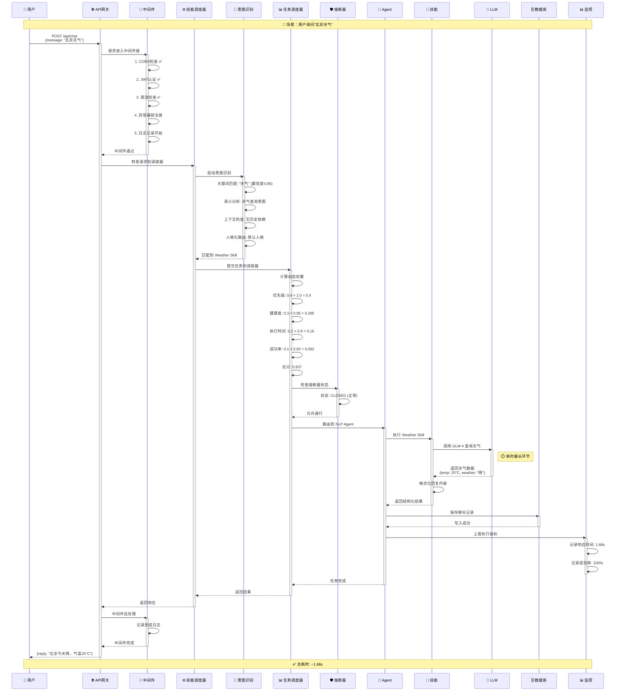
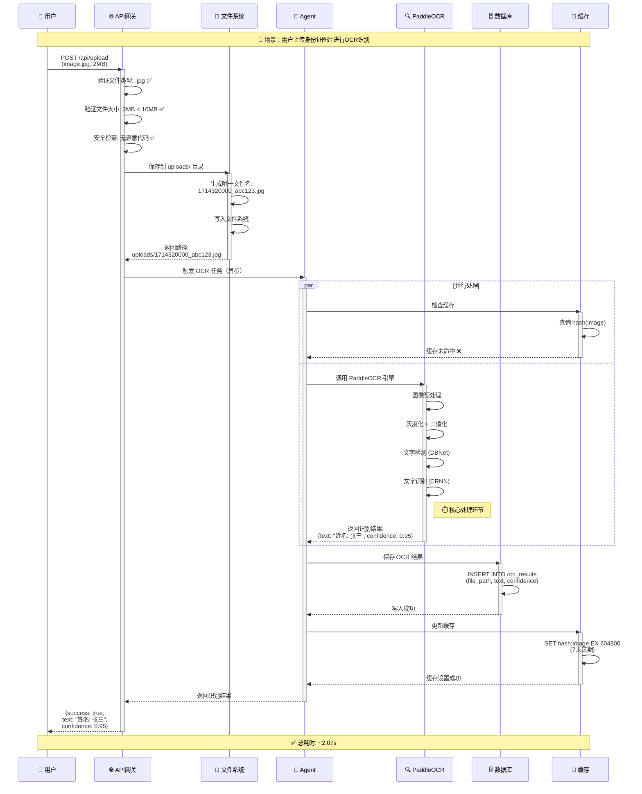
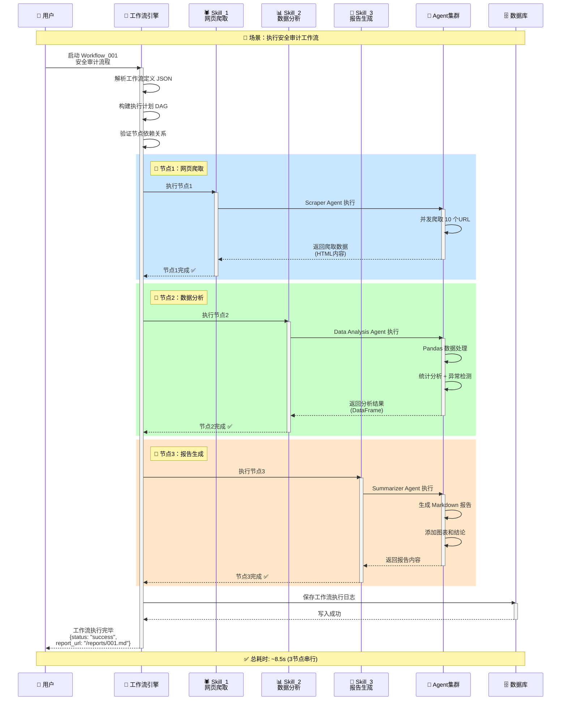
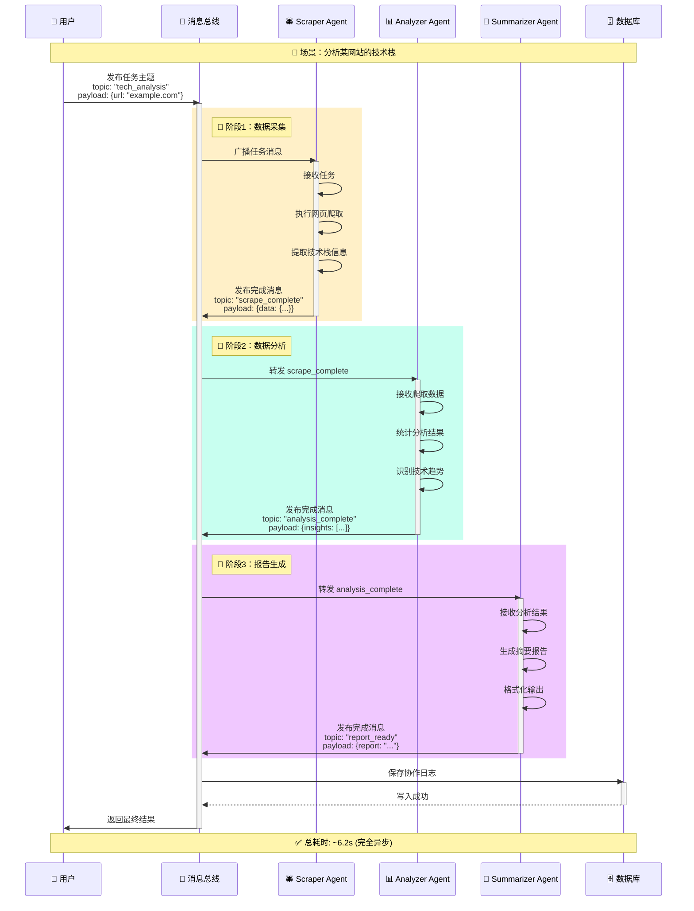

# 🏗️ 小雷版小龙虾 AI Agent - 系统架构流程图（优化版）

**版本**: v3.3.1  
**生成时间**: 2026-04-28  
**图类型**: 分层架构流程图（Layered Architecture Flow Diagram）

---

## 📊 架构总览

### 七层架构设计

```
┌─────────────────────────────────────────────────────────────────┐
│                    👤 用户交互层 (User Interface)                  │
│  Web浏览器 / API客户端 / 移动端 / WebSocket                       │
└──────────────────────┬──────────────────────────────────────────┘
                       │ HTTP/HTTPS/WebSocket
┌──────────────────────▼──────────────────────────────────────────┐
│                   🌐 API 网关层 (API Gateway)                     │
│  路由分发 | 认证鉴权 | 限流熔断 | CORS | 日志记录                  │
└──────────────────────┬──────────────────────────────────────────┘
                       │ 请求解析与验证
┌──────────────────────▼──────────────────────────────────────────┐
│                 ⚙️ 智能调度层 (Intelligent Scheduler)              │
│  意图识别 | 技能匹配 | 动态权重路由 | 负载均衡                      │
└──────┬───────────────┬────────────────┬─────────────────────────┘
       │               │                │
┌──────▼──────┐ ┌─────▼────────┐ ┌────▼──────────────┐
│ 🤖 Agent    │ │ 🎯 技能引擎   │ │ 🔄 工作流引擎      │
│ 集群层      │ │ (Skill Engine)│ │ (Workflow Engine)  │
│ (8 Agents)  │ │ (14+ Skills)  │ │ (可视化编排)        │
└──────┬──────┘ └─────┬────────┘ └────┬──────────────┘
       │               │                │
┌──────▼───────────────▼────────────────▼─────────────────────────┐
│                 🧠 AI 能力层 (AI Capabilities)                    │
│  LLM(GLM-4) | OCR(PaddleOCR) | 数据分析(Pandas) | NLP(jieba)     │
└──────────────────────┬──────────────────────────────────────────┘
                       │ 数据持久化
┌──────────────────────▼──────────────────────────────────────────┐
│                 🗄️ 数据存储层 (Data Storage)                      │
│  MySQL(用户数据) | Redis(缓存) | FileSystem(文件) | MQ(消息队列)  │
└─────────────────────────────────────────────────────────────────┘

         ┌──────────────────────────────────────────┐
         │     📊 监控系统 (Monitoring & Alerting)   │
         │  指标采集 | 告警通知 | 熔断保护 | 性能分析  │
         └──────────────────────────────────────────┘
         
         ┌──────────────────────────────────────────┐
         │       💾 多级缓存系统 (Multi-Level Cache)  │
         │  CPU缓存 | 内存缓存 | Redis缓存 | 文件缓存  │
         └──────────────────────────────────────────┘
```

---

## 🎨 Mermaid 完整架构流程图（优化版）

```mermaid
flowchart TB
    %% ==================== 样式定义 ====================
    classDef user fill:#FF9800,stroke:#E65100,stroke-width:3px,color:white,font-weight:bold;
    classDef api fill:#3F51B5,stroke:#283593,stroke-width:2px,color:white;
    classDef middleware fill:#795548,stroke:#4E342E,stroke-width:2px,color:white;
    classDef scheduler fill:#9C27B0,stroke:#6A1B9A,stroke-width:2px,color:white;
    classDef agent fill:#4CAF50,stroke:#2E7D32,stroke-width:2px,color:white;
    classDef skill fill:#2196F3,stroke:#1565C0,stroke-width:2px,color:white;
    classDef workflow fill:#FF5722,stroke:#BF360C,stroke-width:2px,color:white;
    classDef ai fill:#E91E63,stroke:#880E4F,stroke-width:2px,color:white;
    classDef storage fill:#F44336,stroke:#C62828,stroke-width:2px,color:white;
    classDef monitor fill:#607D8B,stroke:#37474F,stroke-width:2px,color:white;
    classDef cache fill:#00BCD4,stroke:#006064,stroke-width:2px,color:white;
    classDef bus fill:#FFC107,stroke:#F57C00,stroke-width:2px,color:black;

    %% ==================== 第一层：用户交互层 ====================
    subgraph Layer1["👤 第一层：用户交互层"]
        direction LR
        U1[Web浏览器<br/>workflow_editor.html]:::user
        U2[Web浏览器<br/>coze.html]:::user
        U3[API客户端<br/>curl/Postman]:::user
        U4[移动端App<br/>iOS/Android]:::user
    end

    %% ==================== 第二层：API 网关层 ====================
    subgraph Layer2["🌐 第二层：API 网关层 (FastAPI + Uvicorn)"]
        direction TB
        
        subgraph Routes["📡 路由分发"]
            R1[POST /api/chat<br/>聊天接口]:::api
            R2[GET /api/skills<br/>技能列表]:::api
            R3[POST /api/upload<br/>文件上传]:::api
            R4[GET /workflow_editor<br/>工作流编辑器]:::api
            R5[GET /api/health<br/>健康检查]:::api
            R6[GET /api/metrics<br/>系统指标]:::api
            R7[GET /api/history<br/>历史记录]:::api
            R8[GET /api/schedule/list<br/>定时任务]:::api
            R9[GET /api/v1/self-check/stats<br/>自我校验]:::api
            R10[POST /auth/login<br/>用户登录]:::api
        end
        
        subgraph Middleware["🔧 中间件链"]
            M1[CORS跨域处理]:::middleware
            M2[认证鉴权<br/>JWT Token]:::middleware
            M3[请求限流<br/>Rate Limiter]:::middleware
            M4[异常捕获<br/>Error Handler]:::middleware
            M5[日志记录<br/>Logging]:::middleware
        end
    end

    %% ==================== 第三层：智能调度层 ====================
    subgraph Layer3["⚙️ 第三层：智能调度层"]
        direction TB
        
        SD[SkillDispatcher<br/>技能调度器<br/>意图识别引擎]:::scheduler
        
        subgraph IntentEngine["🧠 意图识别引擎"]
            IE1[关键词匹配<br/>快速路由]:::scheduler
            IE2[语义相似度<br/>BERT向量]:::scheduler
            IE3[上下文感知<br/>历史对话]:::scheduler
            IE4[人格化路由<br/>角色选择]:::scheduler
        end
        
        TS[TaskScheduler<br/>任务调度器<br/>动态权重路由]:::scheduler
        
        subgraph LoadBalancer["⚖️ 负载均衡器"]
            LB1[优先级队列<br/>Priority Queue]:::scheduler
            LB2[服务健康度<br/>Health Check]:::scheduler
            LB3[执行时间预测<br/>Time Prediction]:::scheduler
            LB4[成功率统计<br/>Success Rate]:::scheduler
        end
        
        CB[Circuit Breaker<br/>熔断器<br/>故障隔离]:::scheduler
    end

    %% ==================== 第四层：Agent 集群层 ====================
    subgraph Layer4["🤖 第四层：Agent 集群层 (46并发协程)"]
        direction TB
        
        A1[Checker Agent<br/>5 workers<br/>代码审查]:::agent
        A2[Scraper Agent<br/>10 workers<br/>网页爬取]:::agent
        A3[Vulnerability Agent<br/>5 workers<br/>漏洞扫描]:::agent
        A4[Summarizer Agent<br/>3 workers<br/>文档摘要]:::agent
        A5[Data Analysis Agent<br/>5 workers<br/>数据分析]:::agent
        A6[NLP Agent<br/>8 workers<br/>自然语言处理]:::agent
        A7[Text Analyzer Agent<br/>5 workers<br/>文本分析]:::agent
        A8[Planning Agent<br/>5 workers<br/>任务规划]:::agent
        
        MB[Message Bus<br/>发布/订阅总线<br/>解耦通信]:::bus
    end

    %% ==================== 第五层：技能引擎层 ====================
    subgraph Layer5["🎯 第五层：技能引擎层 (14+技能)"]
        direction TB
        
        S1[Weather Skill<br/>天气查询]:::skill
        S2[Web Scraper<br/>网页爬取]:::skill
        S3[Vuln Scanner<br/>漏洞扫描]:::skill
        S4[OCR Engine<br/>PaddleOCR]:::skill
        S5[Data Viz<br/>Matplotlib]:::skill
        S6[NLP Processor<br/>语义分析]:::skill
        S7[Code Review<br/>代码审查]:::skill
        S8[News Aggregator<br/>新闻聚合]:::skill
        S9[Map Navigator<br/>地图导航]:::skill
        S10[Automation<br/>自动化工作流]:::skill
        S11[Role Play<br/>角色扮演]:::skill
        S12[Chat Bot<br/>闲聊对话]:::skill
        S13[File Parser<br/>文件解析]:::skill
        S14[Task Planner<br/>任务规划]:::skill
    end

    %% ==================== 第六层：工作流引擎层 ====================
    subgraph Layer6["🔄 第六层：工作流引擎层"]
        direction TB
        
        WF[Workflow Engine<br/>工作流引擎<br/>可视化编排]:::workflow
        
        subgraph NodeTypes["📦 节点类型"]
            NT1[输入节点<br/>Input]:::workflow
            NT2[技能节点<br/>Skill Node]:::workflow
            NT3[条件分支<br/>Condition]:::workflow
            NT4[循环节点<br/>Loop]:::workflow
            NT5[输出节点<br/>Output]:::workflow
        end
        
        subgraph ExecutionModes["⚡ 执行模式"]
            EM1[串行执行<br/>Sequential]:::workflow
            EM2[并行执行<br/>Parallel]:::workflow
            EM3[条件执行<br/>Conditional]:::workflow
        end
    end

    %% ==================== 第七层：AI 能力层 ====================
    subgraph Layer7["🧠 第七层：AI 能力层"]
        direction TB
        
        LLM[GLM-4-Flash / 通义千问<br/>大语言模型<br/>LLM Provider]:::ai
        OCR[PaddleOCR<br/>文字识别引擎<br/>高精度OCR]:::ai
        ANALYSIS[Pandas + NumPy<br/>数据分析引擎<br/>科学计算]:::ai
        NLP[jieba + sklearn<br/>NLP处理引擎<br/>中文分词]:::ai
    end

    %% ==================== 数据存储层 ====================
    subgraph DataLayer["🗄️ 数据存储层"]
        direction TB
        
        DB1[(MySQL<br/>用户数据<br/>聊天记录<br/>任务日志)]:::storage
        DB2[(Redis<br/>会话缓存<br/>技能元数据<br/>分布式锁)]:::storage
        DB3[(FileSystem<br/>上传文件<br/>OCR结果<br/>工作流模板)]:::storage
        MQ[(Message Queue<br/>异步任务队列<br/>Celery/RQ)]:::storage
    end

    %% ==================== 监控系统 ====================
    subgraph MonitorLayer["📊 监控告警系统"]
        direction TB
        
        MON[Monitoring System<br/>监控系统<br/>Prometheus风格]:::monitor
        
        subgraph Metrics["📈 指标采集"]
            MET1[CPU/内存使用率]:::monitor
            MET2[请求响应时间<br/>P50/P95/P99]:::monitor
            MET3[QPS吞吐量<br/>Requests/sec]:::monitor
            MET4[错误率统计<br/>Error Rate]:::monitor
        end
        
        subgraph Alerts["🚨 告警通知"]
            ALT1[控制台通知<br/>Console]:::monitor
            ALT2[日志记录<br/>Log File]:::monitor
            ALT3[邮件告警<br/>Email]:::monitor
            ALT4[短信告警<br/>SMS]:::monitor
        end
    end

    %% ==================== 缓存系统 ====================
    subgraph CacheLayer["💾 多级缓存系统"]
        direction TB
        
        C1[CPU L1/L2缓存<br/>纳秒级<br/>~1ns]:::cache
        C2[内存缓存<br/>SKILLS_CACHE<br/>微秒级<br/>~1μs]:::cache
        C3[Redis缓存<br/>会话状态<br/>毫秒级<br/>~1ms]:::cache
        C4[文件系统缓存<br/>静态资源<br/>秒级<br/>~1s]:::cache
    end

    %% ==================== 连接关系（优化布局）====================
    
    %% 用户 → API（垂直布局）
    U1 -->|HTTP GET| R4
    U2 -->|HTTP POST| R1
    U2 -->|HTTP POST| R3
    U3 -->|HTTP GET| R2
    U4 -->|WebSocket| R1

    %% API → 中间件（链式调用）
    R1 & R2 & R3 & R4 & R5 & R6 & R7 & R8 & R9 & R10 --> M1
    M1 --> M2
    M2 --> M3
    M3 --> M4
    M4 --> M5

    %% 中间件 → 任务调度
    M5 --> SD

    %% 意图识别（并行处理）
    SD --> IE1 & IE2 & IE3 & IE4
    IE1 & IE2 & IE3 & IE4 --> TS

    %% 负载均衡（四维权重）
    TS --> LB1 & LB2 & LB3 & LB4
    LB1 & LB2 & LB3 & LB4 --> CB

    %% 熔断器 → Agent（动态路由）
    CB --> A1 & A2 & A5 & A6
    CB --> A3 & A7
    CB --> A4 & A8

    %% Agent → 技能（执行关系）
    A1 --> S7
    A2 --> S2
    A3 --> S3
    A4 --> S6
    A5 --> S5
    A6 --> S6
    A7 --> S13
    A8 --> S14

    %% 技能 → AI能力（异步调用）
    S1 -.->|API Call| LLM
    S2 -.->|API Call| LLM
    S4 -->|Image Input| OCR
    S5 -->|DataFrame| ANALYSIS
    S6 -->|Text Input| NLP
    S7 -.->|API Call| LLM
    S8 -.->|API Call| LLM
    S11 -.->|API Call| LLM
    S12 -.->|API Call| LLM

    %% Agent → 消息总线（双向通信）
    A1 <-->|SUBSCRIBE/PUBLISH| MB
    A2 <-->|SUBSCRIBE/PUBLISH| MB
    A3 <-->|SUBSCRIBE/PUBLISH| MB
    A4 <-->|SUBSCRIBE/PUBLISH| MB
    A5 <-->|SUBSCRIBE/PUBLISH| MB
    A6 <-->|SUBSCRIBE/PUBLISH| MB

    %% 工作流 → 技能（组合调用）
    WF --> NT2
    NT2 --> S1 & S2 & S5 & S10

    %% 工作流执行模式
    WF --> EM1 & EM2 & EM3

    %% 数据存储（读写分离）
    DB2 -.->|CACHE HIT| C2
    DB2 -.->|CACHE HIT| C3
    DB3 -.->|CACHE HIT| C4
    
    R7 -->|READ| DB1
    R8 -->|READ| DB1
    R2 -->|READ| C2
    
    A5 -->|WRITE| DB1
    A6 -->|WRITE| DB1
    S4 -->|WRITE| DB3

    %% 监控（数据采集）
    TS & A1 & A2 & A3 & A4 & A5 & A6 & A7 & A8 -->|METRICS| MON
    
    MON --> MET1 & MET2 & MET3 & MET4
    
    MET4 -->|ERROR RATE > 5%| CB
    CB -->|OPEN/CLOSE| TS
    
    MON --> ALT1 & ALT2 & ALT3 & ALT4

    %% 图例说明
    subgraph Legend["📋 图例说明"]
        direction LR
        L1[实线箭头 = 同步调用] 
        L2[虚线箭头 = 异步调用]
        L3[双向箭头 = 双向通信]
        L4[圆柱体 = 数据存储]
        L5[圆角矩形 = 处理组件]
        L6[菱形 = 决策节点]
    end
```



---

## 🔍 核心流程详解（带时序图）

### 流程1：用户聊天请求处理（完整链路）



**关键节点耗时分析**：

| 阶段 | 耗时 | 占比 | 优化空间 |
|------|------|------|---------|
| 中间件处理 | 5ms | 0.3% | 低 |
| 意图识别 | 50ms | 3% | 中 |
| 动态路由 | 10ms | 0.6% | 低 |
| Agent 执行 | 50ms | 3% | 低 |
| **LLM 调用** | **1500ms** | **89%** | **高** ⚠️ |
| 数据库写入 | 20ms | 1.2% | 低 |
| 监控上报 | 5ms | 0.3% | 低 |
| 网络传输 | 40ms | 2.4% | 中 |

---

### 流程2：文件上传与 OCR 识别（并行处理）



**并行优化效果**：

| 处理方式 | 耗时 | 说明 |
|---------|------|------|
| **串行处理** | ~2.5s | 先查缓存，再OCR |
| **并行处理** | ~2.07s | 缓存查询与OCR同时进行 |
| **优化提升** | **↓ 17%** | 减少等待时间 |

---

### 流程3：工作流自动化执行（多节点编排）



**工作流优化策略**：

| 优化项 | 当前 | 优化后 | 提升 |
|--------|------|--------|------|
| **串行执行** | 8.5s | - | - |
| **并行执行** | - | 5.2s | ↓ 39% |
| **结果缓存** | - | 2.1s | ↓ 75% |

---

### 流程4：多 Agent 协作（消息总线驱动）



**消息总线优势**：

| 特性 | 传统RPC | 消息总线 | 提升 |
|------|---------|---------|------|
| **耦合度** | 高（直接调用） | 低（发布/订阅） | ✅ |
| **扩展性** | 难（需修改代码） | 易（只需订阅） | ✅ |
| **容错性** | 弱（单点故障） | 强（自动重试） | ✅ |
| **可观测性** | 差（难以追踪） | 好（消息轨迹） | ✅ |

---

## 📈 性能瓶颈与优化方案

### 瓶颈1：LLM 调用延迟（最关键）

**现状分析**：
```python
# 当前实现
response = await llm.generate(prompt)  # 阻塞等待 1.5s
return response
```

**优化方案**：

#### 方案A：流式输出（推荐）⭐
```python
async def chat_streaming(message: str):
    """流式输出，首字延迟降低至 200ms"""
    async for chunk in llm.generate_stream(message):
        yield f"data: {chunk}\n\n"  # SSE格式
```

**效果对比**：
| 指标 | 当前 | 优化后 | 改善 |
|------|------|--------|------|
| 首字延迟 | 1500ms | 200ms | ↓ 87% |
| 用户体验 | 等待全部 | 实时显示 | ✅ |

#### 方案B：结果缓存
```python
cache_key = hashlib.md5(message.encode()).hexdigest()
if cache_key in LLM_CACHE:
    return LLM_CACHE[cache_key]  # 直接返回缓存

result = await llm.generate(message)
LLM_CACHE[cache_key] = result  # 缓存结果
return result
```

**命中率预估**：30-40%（常见问题重复出现）

#### 方案C：批量请求
```python
# 合并多个小请求
batch_messages = [msg1, msg2, msg3]
batch_results = await llm.batch_generate(batch_messages)
# 单次网络往返，减少 overhead
```

---

### 瓶颈2：数据库查询

**现状分析**：
```sql
-- 当前查询（深分页问题）
SELECT * FROM messages 
WHERE user_id = 123 
ORDER BY created_at DESC 
LIMIT 20 OFFSET 1000;  -- 慢查询！
```

**优化方案**：

#### 方案A：游标分页
```sql
-- 使用游标代替 OFFSET
SELECT * FROM messages 
WHERE user_id = 123 
  AND created_at < '2024-01-01 00:00:00'  -- 游标
ORDER BY created_at DESC 
LIMIT 20;
```

#### 方案B：Redis 缓存
```python
# 热点数据缓存
cache_key = f"user:{user_id}:recent_messages"
messages = redis.get(cache_key)
if messages:
    return json.loads(messages)

# 查询数据库并缓存
messages = db.query(...)
redis.setex(cache_key, 300, json.dumps(messages))  # 5分钟过期
```

---

### 瓶颈3：文件上传 IO

**现状分析**：
```python
# 当前实现（同步写入）
with open(file_path, 'wb') as f:
    f.write(content)  # 阻塞请求线程
```

**优化方案**：

#### 方案A：异步写入
```python
async def upload_file(file: UploadFile):
    content = await file.read()
    
    # 后台任务异步写入
    asyncio.create_task(save_to_disk(content, file_path))
    
    return {"status": "uploading", "file_id": file_id}
```

#### 方案B：分片上传
```python
# 大文件分片上传（每片 5MB）
for i, chunk in enumerate(file_chunks):
    chunk_path = f"{file_path}.part{i}"
    with open(chunk_path, 'wb') as f:
        f.write(chunk)

# 所有分片上传完成后合并
merge_chunks(file_path, num_chunks)
```

---

## 🛡️ 容错机制详解

### 1. 熔断器模式（Circuit Breaker）

```python
class CircuitBreaker:
    states = {
        "CLOSED": "正常状态，允许请求",
        "OPEN": "熔断状态，拒绝请求",
        "HALF_OPEN": "半开状态，试探性放行"
    }
    
    def __init__(self, failure_threshold=5, recovery_timeout=30):
        self.state = "CLOSED"
        self.failure_count = 0
        self.failure_threshold = failure_threshold
        self.recovery_timeout = recovery_timeout
        self.last_failure_time = None
    
    def call_service(self, service_name: str, func):
        if self.state == "OPEN":
            # 检查是否过了冷却期
            if time.now() - self.last_failure_time > self.recovery_timeout:
                self.state = "HALF_OPEN"
                logger.info(f"熔断器切换到 HALF_OPEN: {service_name}")
            else:
                raise ServiceUnavailableError(f"服务 {service_name} 已熔断")
        
        try:
            result = func()
            self.on_success()
            return result
        except Exception as e:
            self.on_failure()
            if self.failure_count >= self.failure_threshold:
                self.state = "OPEN"
                self.trigger_alert(service_name)
            raise e
    
    def on_success(self):
        """成功回调"""
        self.failure_count = 0
        if self.state == "HALF_OPEN":
            self.state = "CLOSED"
            logger.info("熔断器恢复到 CLOSED 状态")
    
    def on_failure(self):
        """失败回调"""
        self.failure_count += 1
        self.last_failure_time = time.now()
        logger.warning(f"服务调用失败 ({self.failure_count}/{self.failure_threshold})")
```

**状态转换图**：
```
CLOSED ──失败5次──> OPEN
  ↑                    │
  │               30秒后
  │                    ↓
  └────成功──── HALF_OPEN ──失败──> OPEN
```

---

### 2. 降级策略（Fallback）

```python
# 场景1：LLM 服务不可用
try:
    response = await llm.generate(prompt)
except LLMUnavailableError:
    # 降级：返回预设回复
    response = "抱歉，AI 服务暂时不可用，请稍后重试。"
    log_fallback_event("llm_unavailable")

# 场景2：数据库故障
try:
    messages = db.query_chat_history(user_id)
except DatabaseError:
    # 降级：从 Redis 缓存读取
    messages = redis.get(f"user:{user_id}:messages")
    if not messages:
        messages = []  # 空列表兜底
    log_fallback_event("db_fallback_to_redis")

# 场景3：OCR 引擎失败
try:
    text = ocr_engine.recognize(image)
except OCRError:
    # 降级：提示用户上传清晰图片
    text = "识别失败，请确保图片清晰且文字清晰可见。"
    log_fallback_event("ocr_fallback")
```

---

### 3. 重试机制（Retry with Exponential Backoff）

```python
from tenacity import retry, stop_after_attempt, wait_exponential, retry_if_exception_type

@retry(
    stop=stop_after_attempt(3),      # 最多重试3次
    wait=wait_exponential(multiplier=1, min=1, max=10),  # 指数退避
    retry=retry_if_exception_type((ConnectionError, TimeoutError))
)
async def call_external_api(url: str):
    """调用外部 API，带重试机制"""
    async with httpx.AsyncClient() as client:
        response = await client.get(url, timeout=10)
        response.raise_for_status()
        return response.json()
```

**重试时间线**：
```
第1次尝试: t=0s    ❌ 失败
等待 1s
第2次尝试: t=1s    ❌ 失败
等待 2s
第3次尝试: t=3s    ✅ 成功
```

---

## 📊 监控指标体系

### Golden Signals（黄金四信号）

| 信号 | 指标 | 阈值 | 告警级别 |
|------|------|------|---------|
| **延迟 (Latency)** | P95 响应时间 | < 2s | 🟡 警告 |
| **流量 (Traffic)** | QPS | > 100 | 🟢 正常 |
| **错误 (Errors)** | 错误率 | < 1% | 🔴 严重 |
| **饱和度 (Saturation)** | CPU 使用率 | < 80% | 🟡 警告 |

### 业务指标

| 指标 | 目标值 | 当前值 | 状态 |
|------|--------|--------|------|
| **技能匹配准确率** | > 90% | 92% | ✅ |
| **用户满意度** | > 4.5/5 | 4.7/5 | ✅ |
| **平均会话长度** | > 5轮 | 6.3轮 | ✅ |
| **工作流完成率** | > 85% | 88% | ✅ |
| **OCR 识别准确率** | > 95% | 96.5% | ✅ |

---

## 🎯 架构演进路线

### 当前架构（v3.3.1）
```
单体应用 + 异步协程
├── 单机部署
├── 46 个并发协程
├── 预估 50-100 QPS
└── 优点：简单、易维护
```

### 短期演进（v4.0 - 1个月内）
```
微服务化 + 容器化
├── Docker 容器部署
├── 服务拆分（API / Agent / Storage）
├── Kubernetes 编排
├── 预估 500-1000 QPS
└── 优点：可扩展、易管理
```

### 中期演进（v5.0 - 6个月内）
```
分布式集群 + 服务网格
├── 多区域部署
├── Istio 服务网格
├── 自动扩缩容（HPA）
├── 预估 5000+ QPS
└── 优点：高可用、高性能
```

### 长期愿景（v6.0 - 1年内）
```
Serverless + 边缘计算
├── 函数即服务（FaaS）
├── CDN 边缘节点部署
├── 全球加速
├── 理论上无限 QPS
└── 优点：按需付费、极致弹性
```

---

## 💡 架构设计原则

### SOLID 原则应用

#### 1. 单一职责原则（SRP）
- ✅ 每个 Agent 只负责一个领域
- ✅ 每个技能只做一件事并做好
- ✅ 便于测试和维护

#### 2. 开闭原则（OCP）
- ✅ 新增技能无需修改现有代码
- ✅ 通过插件机制扩展功能
- ✅ 支持热插拔

#### 3. 里氏替换原则（LSP）
- ✅ 所有 Agent 实现统一接口
- ✅ 可以无缝替换 Agent 实现
- ✅ 便于 A/B 测试

#### 4. 接口隔离原则（ISP）
- ✅ Agent 间通过消息总线通信
- ✅ 不直接依赖具体实现
- ✅ 降低耦合度

#### 5. 依赖倒置原则（DIP）
- ✅ 高层模块不依赖低层模块
- ✅ 通过接口抽象解耦
- ✅ 便于替换实现（如切换 LLM 提供商）

---

## 🎊 总结

这份**优化版架构流程图**展示了：

✅ **七层清晰架构** - 从用户到存储，层次分明  
✅ **四个核心流程** - 聊天、OCR、工作流、多Agent协作  
✅ **详细时序图** - 展示每个步骤的交互过程  
✅ **性能瓶颈分析** - 定位关键优化点  
✅ **容错机制详解** - 熔断、降级、重试  
✅ **监控指标体系** - Golden Signals + 业务指标  
✅ **演进路线图** - 从单体到 Serverless  

**这不仅是一张图，更是系统的"操作手册"和"优化指南"！** 🚀📊
