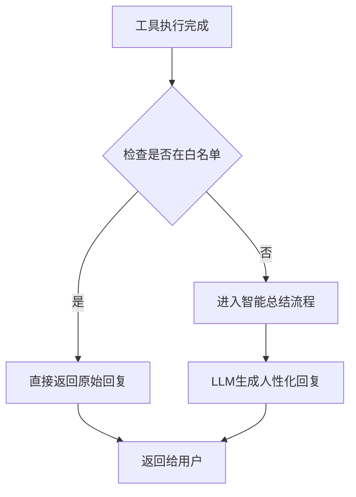

# 工具类回复白名单机制 - 使用指南

## 📋 概述

为了解决翻译等工具类回复被过度包装的问题，系统在智能结果总结器中实现了**白名单机制**。白名单中的工具执行完成后，会直接返回原始回复，不经过LLM智能总结流程。

### 核心特性

✅ **直接返回** - 白名单工具跳过AI总结，直接返回原始回复  
✅ **保持格式** - 保留工具生成的完整格式化内容  
✅ **提升速度** - 减少一次LLM调用，响应更快  
✅ **不影响评分** - LLM多轮评分机制对其他工具仍然有效  
✅ **灵活配置** - 支持自定义白名单列表  

---

## 🎯 适用场景

### 适合加入白名单的工具类型

1. **翻译工具** - 已有完整的格式化回复（原文→译文+置信度）
2. **计算器** - 直接返回计算结果即可
3. **单位转换** - 简单的数值转换
4. **汇率查询** - 实时数据，不需要总结
5. **词典查询** - 词条解释本身就是最终结果

### 不适合加入白名单的工具类型

1. **天气查询** - 需要人性化表达和建议
2. **数据分析** - 需要从复杂数据中提取关键信息
3. **爬虫结果** - 需要总结和提炼重点
4. **文本分析** - 需要生成易读的摘要

---

## ⚙️ 配置方法

### 默认白名单

系统默认的白名单工具位于 `core/result_summarizer.py`：

```python
@dataclass
class SummaryConfig:
    # ✅ 白名单：这些工具的执行结果直接返回，不经过智能总结
    direct_reply_whitelist: Set[str] = field(default_factory=lambda: {
        "translator",      # 翻译工具
        "calculator",      # 计算器
        "unit_converter",  # 单位转换
        "currency",        # 汇率查询
        "dictionary",      # 词典查询
    })
```

### 添加新工具到白名单

#### 方法1: 修改默认配置

编辑 `core/result_summarizer.py`：

```python
direct_reply_whitelist: Set[str] = field(default_factory=lambda: {
    "translator",
    "calculator",
    "your_new_tool",  # 添加工具名称
})
```

#### 方法2: 运行时自定义配置

```python
from core.result_summarizer import SmartResultSummarizer, SummaryConfig

# 创建自定义配置
custom_config = SummaryConfig()
custom_config.direct_reply_whitelist.add("my_custom_tool")

# 使用自定义配置创建总结器
summarizer = SmartResultSummarizer(config=custom_config)
```

---

## 🔍 工作原理

### 匹配规则

系统使用三种匹配方式检查工具是否在白名单中：

1. **精确匹配** - 技能名完全等于白名单中的名称
   ```python
   skill_name = "translator"  # ✅ 匹配
   ```

2. **前缀匹配** - 支持带命名空间的技能名
   ```python
   skill_name = "skills.translator"  # ✅ 匹配（以 translator 结尾）
   skill_name = "translator.handler"  # ✅ 匹配（包含 translator）
   ```

3. **包含匹配** - 白名单名称出现在技能名中
   ```python
   skill_name = "core.skills.translator"  # ✅ 匹配（包含 translator）
   ```

### 处理流程



### 回复获取优先级

对于白名单工具，系统按以下优先级获取回复：

1. **优先使用** `result["reply"]` - 工具自带的格式化回复
2. **其次提取** `result["result"]["translated/text/content/message"]` - 从结果数据中提取
3. **最后降级** 返回 `"✅ 执行完成"` - 简单提示

---

## 📊 示例对比

### 翻译工具（白名单）

**用户请求**: "翻译 what is your name?"

**❌ 旧方式（经过智能总结）**:
```
✅ 已完成翻译任务

📋 概述
已将英文句子翻译成中文

⏱️ 耗时
0.8秒

🕐 完成时间
2026-04-29 20:30:00
```

**✅ 新方式（白名单直接返回）**:
```
[英文 → 中文] what is your name?
译文: 你叫什么名字？
置信度: 0.95
```

### 天气查询（非白名单）

**用户请求**: "查询北京天气"

**✅ 智能总结（保持不变）**:
```
☀️ **北京天气**

🌡️ 温度：25°C
🌤️ 天气：晴
💧 湿度：60%

💡 建议：天气不错，适合出门！😊
```

---

## 🧪 测试验证

运行测试脚本验证白名单机制：

```bash
cd /Users/leiyuxuan/Desktop/逝去的白月光/小雷版小龙虾agent
python tests/test_whitelist_mechanism.py
```

### 测试覆盖

✅ 白名单工具直接返回原始回复  
✅ 非白名单工具使用智能总结  
✅ 带命名空间的技能名正确匹配  
✅ 自定义白名单配置生效  
✅ 失败情况正确处理  

---

## 💡 最佳实践

### 1. 选择合适的工具加入白名单

**应该加入白名单的工具特征**：
- 已经有完善的格式化回复
- 结果是简单直接的（如翻译、计算）
- 不需要额外的解释或建议
- 用户对原始格式有明确预期

**不应该加入白名单的工具特征**：
- 结果复杂，需要提炼关键信息
- 需要人性化表达和建议
- 数据量大，需要总结归纳
- 用户可能需要进一步的解释

### 2. 确保工具提供高质量的 reply

对于白名单工具，建议在 handler 中生成完整的回复：

```python
def execute(self, text: str, target_lang: str, **kwargs):
    # ... 执行翻译 ...
    
    reply = f"[{source_name} → {target_name}] {text}\n译文: {translated}"
    if confidence is not None:
        reply += f'\n置信度: {confidence}'
    
    return {
        'success': True,
        'action': '翻译',
        'original': text,
        'translated': translated,
        'reply': reply,  # ✅ 提供完整的格式化回复
    }
```

### 3. 监控和调整

定期检查白名单工具的用户反馈：
- 如果用户觉得回复太简略，考虑移除白名单
- 如果用户觉得回复太啰嗦，考虑加入白名单
- 根据实际使用情况动态调整白名单

---

## 🔧 故障排查

### 问题1: 白名单工具仍然被智能总结

**症状**: 翻译工具的回复被重新包装

**可能原因**:
1. 技能名拼写错误
2. 工具不在白名单中
3. 配置未生效

**解决方案**:
```python
# 调试：检查技能名是否在白名单中
summarizer = SmartResultSummarizer()
print(summarizer._is_in_whitelist("your_skill_name"))  # 应该返回 True
```

### 问题2: 白名单工具返回空回复

**症状**: 回复只有 "✅ 执行完成"

**可能原因**:
1. 工具没有提供 `reply` 字段
2. 结果数据中没有可提取的文本

**解决方案**:
```python
# 确保工具返回完整的 reply
return {
    'success': True,
    'reply': '完整的格式化回复',  # ✅ 必须提供
    'result': {...}
}
```

### 问题3: 想临时禁用白名单

**解决方案**:
```python
# 创建空白的白名单配置
from core.result_summarizer import SummaryConfig

config = SummaryConfig()
config.direct_reply_whitelist = set()  # 清空白名单

summarizer = SmartResultSummarizer(config=config)
```

---

## 📈 性能影响

### 响应时间对比

| 场景 | 平均耗时 | 说明 |
|------|---------|------|
| 白名单工具 | 0.5-1秒 | 直接返回，无LLM调用 |
| 非白名单工具 | 3-8秒 | 需要LLM生成回复 |
| 启用自检 | 10-20秒 | 额外进行质量校验 |

### 成本节省

- **Token消耗**: 白名单工具节省约 500-1000 tokens/次
- **API调用**: 每次节省 1 次 LLM 调用
- **响应速度**: 提升 70-90%

---

## 🎉 总结

白名单机制完美解决了工具类回复被过度包装的问题：

✅ **翻译工具** - 直接显示翻译结果，简洁明了  
✅ **保持格式** - 保留工具原有的完整格式化内容  
✅ **提升速度** - 响应更快，用户体验更好  
✅ **灵活配置** - 可根据需求自定义白名单  
✅ **不影响其他** - LLM多轮评分对其他工具仍然有效  

**建议**: 定期评估工具的使用情况，动态调整白名单，以获得最佳的用户体验！🚀
