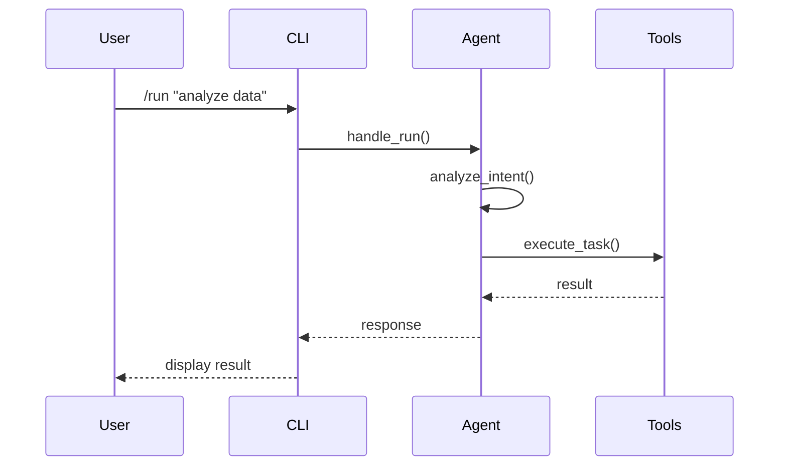
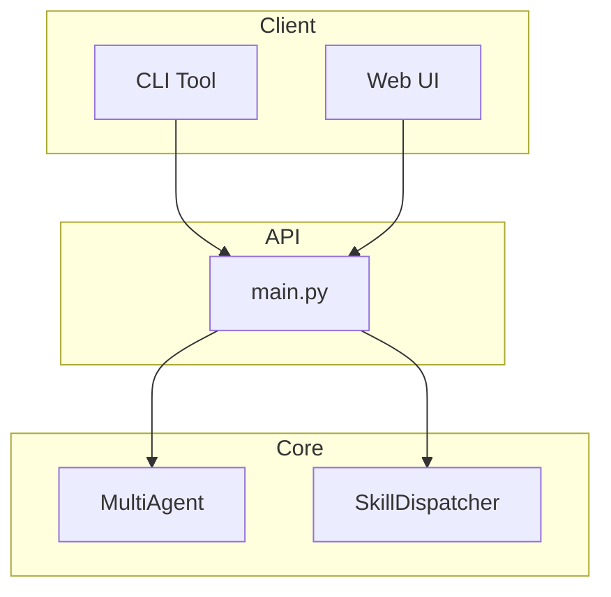

# Architecture Diagrams

This directory contains architecture diagrams in multiple formats:
- Mermaid format (.mmd)
- PlantUML format (.puml)

## Available Diagrams

### System Architecture
- `system_architecture.mmd` - Overall system architecture
- `system_architecture.puml` - PlantUML version

### Component Diagrams
- `multi_agent_system.mmd` - Multi-agent system architecture
- `api_routes.mmd` - API routes architecture
- `mcp_integration.mmd` - MCP server integration

### Sequence Diagrams
- `request_flow.mmd` - Request processing flow
- `multi_step_task.mmd` - Multi-step task processing
- `agent_collaboration.mmd` - Agent collaboration workflow

### Class Diagrams
- `agent_classes.mmd` - Agent class hierarchy
- `core_modules.mmd` - Core module structure

## Viewing Diagrams

### Online
- [Mermaid Live Editor](https://mermaid.live/)
- [PlantUML Online Editor](http://www.plantuml.com/plantuml/uml/)

### VS Code Extensions
- **Mermaid Markdown Syntax Highlighting** - For .mmd files
- **PlantUML** - For .puml files

### Generate Images

```bash
# Using mermaid-cli
npx mermaid-cli -i sequence.mmd -o sequence.svg

# Using plantuml
plantuml sequence.puml
```

## Examples

### Mermaid Sequence Diagram


### Mermaid Component Diagram

