# 两种多Agent架构对比图

## 架构一：V1 角色分工型多Agent（伪多Agent）

```plantuml
@startuml
!define RECTANGLE class

skinparam backgroundColor #FEFEFE
skinparam defaultFontName "Microsoft YaHei"
skinparam packageBorderColor #4472C4
skinparam package {
  BorderColor #4472C4
  BackgroundColor #F0F4FF
}

title 架构一：V1 角色分工型多Agent\n（伪多Agent — 调度器分发，固定角色）

' ======== 调度中心 ========
package "调度中心" as SchedulerCenter #FFE0E0 {
  RECTANGLE AgentScheduler as scheduler #FF6B6B
  note right of scheduler
    负责任务分配
    统一任务提交&状态查询
    不干涉内部执行
  end note
}

' ======== 独立角色Agent ========
package "独立角色 Agent" as Agents #E0FFE0 {
  RECTANGLE CheckerAgent as checker #66BB6A
  note right of checker
    负责检查任务
    独立任务队列
    内部并发分身
  end note

  RECTANGLE ScraperAgent as scraper #66BB6A
  note right of scraper
    负责爬取任务
    独立任务队列
    内部并发分身
  end note

  RECTANGLE VulnAgent as vuln #66BB6A
  note right of vuln
    负责漏洞扫描
    独立任务队列
    内部并发分身
  end note

  RECTANGLE SummarizerAgent as summary #66BB6A
  note right of summary
    负责总结任务
    独立任务队列
    内部并发分身
  end note

  RECTANGLE FrontendAgent as frontend #66BB6A
  note right of frontend
    负责前端展示
    实时监控数据
    WebSocket通信
  end note
}

' ======== 核心支撑系统 ========
package "核心支撑系统" as Core #E0E0FF {
  RECTANGLE ReasoningEngine as reasoning #7C8BFF
  note right of reasoning
    多轮隐式推理
    思维链强化
    自我反思机制
  end note

  RECTANGLE LLMBackend as llm #7C8BFF
  note right of llm
    模型管理与切换
    超时重试机制
    模型优先级路由
  end note

  RECTANGLE Monitoring as mon #7C8BFF
  note right of mon
    系统指标采集
    告警机制
    日志管理
  end note

  RECTANGLE ThirdParty as third #7C8BFF
  note right of third
    多应用集成
    API密钥管理
    统一调用接口
  end note
}

' ======== 任务处理层 ========
package "任务处理层" as TaskLayer #FFF3E0 {
  RECTANGLE TaskProcessor as proc #FFA726
  RECTANGLE TaskExecutor as exec #FFA726
}

' ======== 数据流连接 ========
proc --> scheduler : 提交分解后的任务
exec --> scheduler : 执行具体任务

scheduler --> checker : 分配检查任务
scheduler --> scraper : 分配爬虫任务
scheduler --> vuln : 分配漏洞任务
scheduler --> summary : 分配总结任务
scheduler --> frontend : 分配前端任务

scheduler --> reasoning : 调用深度思考
reasoning --> llm : LLM API调用

scheduler --> mon : 上报系统状态
mon --> frontend : 推送监控数据

scheduler --> third : 调用第三方服务

' ======== 内部并发标注 ========
checker ..> "内部并发分身 ×N" as c_con
scraper ..> "内部并发分身 ×N" as s_con
vuln ..> "内部并发分身 ×N" as v_con
summary ..> "内部并发分身 ×N" as sum_con
frontend ..> "内部并发分身 ×N" as f_con

' ======== 架构特性标注 ========
note bottom of scheduler
  ★ 架构特点 ★
  ● 1个调度中心 → N个固定角色Agent
  ● 单向分发，无Agent间通信
  ● 每个Agent独立队列+并发
  ● 各Agent职责固定不可变
  ● 无Agent间协作协商机制
  ● 单机多实例异步模式
  ● 故障仅影响单个Agent
end note

@enduml
```

## 架构二：V2 智能协作型多Agent（真多Agent）

```plantuml
@startuml
!define RECTANGLE class

skinparam backgroundColor #FEFEFE
skinparam defaultFontName "Microsoft YaHei"
skinparam packageBorderColor #6B3FA0
skinparam package {
  BorderColor #6B3FA0
  BackgroundColor #F5F0FF
}

title 架构二：V2 智能协作型多Agent\n（真多Agent — 自治Agent，动态协作）

' ======== 用户交互层 ========
package "用户交互层" as UI #FFE0E0 {
  RECTANGLE "Web UI" as web
  RECTANGLE "API 网关" as api
  RECTANGLE "移动端" as mobile
  RECTANGLE "第三方" as tparty
}

' ======== 核心编排引擎 ========
package "多Agent 协作引擎" as Engine #F5E6FF {
  package "核心调度层 (Core Orchestration)" as CoreSchedule #E8D5FF {
    RECTANGLE "任务理解" as intent #9B59B6
    note right of intent
      用户意图解析
      任务类型识别
      复杂度评估
    end note

    RECTANGLE "流程编排" as planner #9B59B6
    note right of planner
      依赖关系分析
      执行顺序定义
      动态路径规划
    end note

    RECTANGLE "智能调度" as scheduler #9B59B6
    note right of scheduler
      能力匹配评分
      负载均衡
      动态调整
      资源管控
    end note

    RECTANGLE "结果聚合" as aggregator #9B59B6
    note right of aggregator
      多Agent结果合并
      冲突消解
      去重与排序
    end note

    intent --> planner
    planner --> scheduler
    scheduler --> aggregator
  }

  ' 全局上下文中心
  RECTANGLE "全局上下文与状态中心" as context_center #6B3FA0
  note right of context_center
    GlobalContextCenter
    统一状态广播与订阅
    全链路追踪
    上下文共享
  end note

  CoreSchedule -[hidden]down- context_center

  ' 协作策略层
  package "协作策略层 (Collaboration)" as Collab #D5BFFF {
    RECTANGLE "PipelineStrategy" as pipeline #8E44AD
    note right of pipeline
      流水线模式
      按阶段顺序执行
      结果阶段传递
    end note

    RECTANGLE "MasterSlaveStrategy" as ms #8E44AD
    note right of ms
      主从模式
      主Agent分解+聚合
      从Agent执行
    end note

    RECTANGLE "ReviewStrategy" as review #8E44AD
    note right of review
      评审模式
      多Agent并行工作
      评审达成共识
    end note

    RECTANGLE "AuctionStrategy" as auction #8E44AD
    note right of auction
      拍卖模式
      任务发布竞标
      最适合Agent执行
    end note

    RECTANGLE "HybridStrategy" as hybrid #8E44AD
    note right of hybrid
      混合模式
      动态选择最优策略
    end note
  }
}

' ======== Agent池 ========
package "Agent 池" as AgentPool #E8F5E9 {
  RECTANGLE "MasterAgent" as master #2E7D32
  note right of master
    主Agent
    任务分解
    结果聚合
    协作协调
  end note

  RECTANGLE "WorkerAgent" as worker #2E7D32
  note right of worker
    执行Agent
    具体任务执行
    工具调用
    结果反馈
  end note

  RECTANGLE "ReviewerAgent" as reviewer #2E7D32
  note right of reviewer
    评审Agent
    质量审查
    结果验证
    改进建议
  end note

  RECTANGLE "ExpertAgent" as expert #2E7D32
  note right of expert
    专家Agent
    领域专长
    深度分析
    特殊能力
  end note

  RECTANGLE "MonitorAgent" as monitor #2E7D32
  note right of monitor
    监控Agent
    系统观测
    异常检测
    性能追踪
  end note

  RECTANGLE "CoordinatorAgent" as coord #2E7D32
  note right of coord
    协调Agent
    跨Agent通信
    冲突调解
    任务重分配
  end note
}

' ======== 基础设施层 ========
package "基础设施层" as Infra #FFF3E0 {
  RECTANGLE "AgentPool" as pool #FF9800
  note right of pool
    Agent生命周期管理
    注册·发现·注销
    健康检查
  end note

  RECTANGLE "TaskExecutor" as task_exe #FF9800
  note right of task_exe
    任务执行引擎
    think→act→reflect循环
    超时控制
  end note

  RECTANGLE "CircuitBreaker" as cb #FF9800
  note right of cb
    熔断器
    自动降级
    故障隔离
  end note

  RECTANGLE "RetryHandler" as retry #FF9800
  note right of retry
    自动重试
    指数退避
    最大重试限制
  end note
}

' 每个Agent的独立心智
RECTANGLE "▌ 独立心智系统\n• 意图理解\n• 目标追求\n• 独立记忆\n• 决策逻辑\n• 工具调用\n• 生命周期" as mind #9C27B0

' ======== 数据流连接 ========

' 用户层 → 编排引擎
web --> intent
api --> intent
mobile --> intent
tparty --> intent

' 调度层 → 协作策略
scheduler .up.> pipeline : 选择策略
scheduler .up.> ms
scheduler .up.> review
scheduler .up.> auction
scheduler .up.> hybrid

' 调度层 → Agent池
scheduler --> master : 分配任务
scheduler --> worker
scheduler --> reviewer
scheduler --> expert
scheduler --> monitor
scheduler --> coord

' Agent间通信总线
master <--> worker : AgentMessage通信\n(消息队列)
master <--> reviewer
worker <--> coord
reviewer <--> coord
expert <--> worker
monitor <..> master : 监控数据

' 上下文连接
context_center <..> CoreSchedule : 状态同步
context_center <..> master : 上下文注入
context_center <..> worker
context_center <..> reviewer

' 基础设施连接
pool ..> master : Agent池管理
pool ..> worker
task_exe ..> worker : 执行引擎
task_exe ..> expert
cb ..> master : 熔断保护
retry ..> worker : 重试机制

' 独立心智
master .. mind
worker .. mind
reviewer .. mind
expert .. mind

' ======== 架构特性标注 ========
note bottom of Engine
  ★ 架构特点 ★
  ● 每个Agent有独立心智/目标/记忆/决策/工具
  ● 5种协作模式：流水线/主从/评审/拍卖/混合
  ● 全局上下文中心统一状态管理
  ● 智能调度：意图理解+能力匹配+负载均衡
  ● 全生命周期管理：注册→发现→执行→注销
  ● 故障处理：自动重试+降级+熔断
  ● Agent间通过消息总线通信协作
  ● 自治Agent社会行为，非简单函数调用
end note

@enduml
```



---

## 核心差异总结

| 维度 | V1 角色分工型 | V2 智能协作型 |
|---|---|---|
| **Agent定义** | 给模块起个Agent名字 | 独立心智、目标、记忆 |
| **协作模式** | 简单函数调用/单向分发 | 流水线/主从/评审/拍卖/混合 |
| **上下文管理** | 各模块自己维护 | 全局统一上下文中心 |
| **任务分配** | 固定规则分发 | 智能匹配+动态调整 |
| **故障处理** | 无/单Agent故障 | 自动重试+降级+熔断 |
| **状态同步** | 无 | 统一状态广播与订阅 |
| **可观测性** | 无/基础日志 | 全链路追踪+日志+审计 |
| **通信方式** | 调度器→Agent单向 | Agent间双向消息总线 |
| **灵活性** | 角色固定，不可变 | 动态策略切换+角色扩展 |
