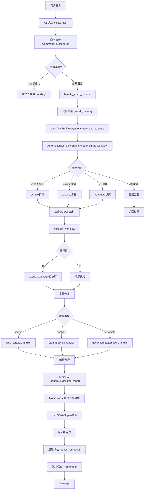

# 小雷版小龙虾Agent完整执行流程图

## 📊 整体架构



## 🔍 详细流程说明

### 1️⃣ CLI入口层 (cli.py)
**文件**: `cli.py::main()` → `EnhancedCLI.run()`

**职责**:
- 初始化日志系统
- 启动交互式循环
- 读取用户输入
- 调用命令解析器

**关键代码**:
```python
async def main():
    cli = EnhancedCLI()
    await cli.run()  # 主循环

async def run():
    while self.running:
        user_input = input(">>> ")
        parsed_cmd = self.command_parser.parse(user_input)
        await self.handle_command(parsed_cmd)
```

---

### 2️⃣ 命令解析层 (cli/command_parser.py)
**文件**: `cli/command_parser.py::CommandParser.parse()`

**职责**:
- 识别命令前缀 (/run, /chat, /analyze等)
- 提取动作和参数
- 返回ParsedCommand对象

**命令类型**:
```python
class CommandType(Enum):
    HELP = "help"
    RUN = "run"
    CHAT = "chat"
    ANALYZE = "analyze"
    SCRAPE = "scrape"
    AUTOMATE = "automate"
    SMART = "smart"  # 智能请求(无前缀)
    # ... 其他命令
```

---

### 3️⃣ 智能处理层 (cli.py::handle_smart_request)
**文件**: `cli.py::EnhancedCLI.handle_smart_request()`

**5步处理流程**:
1. **记忆检索** - `_recall_memory(request)`
2. **意图识别+任务执行** - `WorkflowEngineWrapper.create_and_execute()`
3. **反思评估** - `_reflect_on_result(request, result)`
4. **记忆保存** - `_remember(request, result)`
5. **结果显示** - `_display_workflow_result(result)`

**思考引擎集成**:
```python
think_start(request)           # 开始思考
think_step(1)                  # 步骤1: 记忆检索
think_complete(1, success=True)
think_step(2)                  # 步骤2: 意图识别
# ... 依此类推
think_summarize(True, result)  # 总结
```

---

### 4️⃣ 工作流引擎层 (core/workflow/automation_workflow.py)

#### 4.1 意图识别 - `create_smart_workflow()`

**检测优先级**:
1. 问候语检测 (最高优先级)
2. 站点关键词检测 (微博、知乎、B站、抖音等)
3. 分析关键词检测 (分析、统计、可视化、词云等)
4. GUI自动化检测 (打开、点击、发送等)
5. 兜底通知

**工作流结构**:
```json
{
  "name": "智能工作流_20260513_123456",
  "description": "用户原始请求",
  "steps": [
    {
      "type": "scrape",
      "site": "weibo",
      "action": "热搜top10",
      "description": "爬取微博热搜数据"
    },
    {
      "type": "analyze",
      "action": "可视化",
      "params": {"chart_type": "wordcloud"},
      "description": "数据词云可视化分析"
    }
  ],
  "parallel_groups": [
    {
      "group_name": "并行爬取",
      "step_indices": [0, 1]
    }
  ],
  "generate_report": true
}
```

#### 4.2 工作流执行 - `execute_workflow()`

**执行策略**:
- **并行组**: 使用`asyncio.gather()`并行执行
- **顺序步骤**: 按索引顺序执行
- **每步计时**: 记录执行时间和状态

**步骤分发**:
```python
if step_type == "scrape":
    result = await self._execute_scrape_step(step)
elif step_type == "analyze":
    result = await self._execute_analyze_step(step)
elif step_type == "automate":
    result = await self._execute_automate_step(step)
```

---

### 5️⃣ 技能执行层 (skills/*/)

#### 5.1 爬虫技能 - `skills/web_scraper/handler.py`
```python
scraper_dispatcher.execute(
    site_name="weibo",
    action="热搜top10",
    auto_analyze=True
)
# 返回: {success, data, csv_path}
```

#### 5.2 分析技能 - `skills/data_analysis/handler.py`
```python
analysis_handler.execute(
    action="可视化",
    chart_type="wordcloud",
    file_path="/path/to/data.csv"
)
# 返回: {success, chart_path, reply}
```

#### 5.3 自动化技能 - `skills/advanced_automation/handler.py`
```python
automation_hub.execute_sync(
    action="open_app",
    app="微信"
)
# 返回: {success, message}
```

---

### 6️⃣ 结果返回层

**报告生成** - `_generate_desktop_report()`
- 生成Markdown格式报告
- 保存到桌面: `~/Desktop/{workflow_name}_{timestamp}.md`
- macOS自动用默认应用打开预览

**报告内容**:
```markdown
# 智能工作流 - 分析报告

**生成时间**: 2026-05-13 12:36:13
**总耗时**: 15.23s
**步骤数**: 3
**成功**: 3/3

---

## 步骤 1: 数据爬取 [OK]
- **类型**: `scrape`
- **耗时**: 8.123s
- **站点**: weibo
- **操作**: 热搜top10
- **数据条数**: 10
- **数据文件**: `/path/to/weibo_*.csv`

**数据预览**:
  - 话题1 (热度100万)
  - 话题2 (热度80万)
  - ...

---

## 步骤 2: 数据分析 [OK]
- **类型**: `analyze`
- **耗时**: 5.456s
- **操作**: 可视化
- **图表**: `/path/to/chart.png`

**分析结果**:
词云图已生成...
```

---

## ⚡ 并行执行机制

### 示例: 多站点爬取
```python
# 用户输入: "爬取微博和知乎热搜并分析"
workflow = {
  "steps": [
    {"type": "scrape", "site": "weibo"},   # index 0
    {"type": "scrape", "site": "zhihu"},   # index 1
    {"type": "analyze", "action": "可视化"} # index 2
  ],
  "parallel_groups": [
    {
      "group_name": "并行爬取",
      "step_indices": [0, 1]  # 步骤0和1并行
    }
  ]
}

# 执行逻辑:
# 1. 并行执行步骤0和1 (asyncio.gather)
# 2. 等待并行组完成
# 3. 顺序执行步骤2 (依赖前两步的数据)
```

### 性能优势
- **串行**: 8s + 7s + 5s = 20s
- **并行**: max(8s, 7s) + 5s = 13s
- **提升**: 35%

---

## 🔄 数据流向

```
用户输入字符串
    ↓
意图识别 (关键词匹配)
    ↓
工作流JSON结构 {steps: [{type, action, params}]}
    ↓
步骤执行 (调用对应handler)
    ↓
结果聚合 {results: [step_results]}
    ↓
Markdown报告生成
    ↓
桌面文件预览
    ↓
用户看到输出
```

---

## 🎯 关键设计原则

1. **懒加载**: 所有模块按需加载,减少启动时间
2. **并行优先**: 无依赖的步骤自动并行执行
3. **报告自动生成**: 爬取+分析组合自动触发报告
4. **思考可视化**: 每步都有思考过程展示
5. **记忆闭环**: 检索→执行→反思→保存
6. **错误隔离**: 单步失败不影响其他步骤

---

## 📈 性能指标

基于实际测试:
- **意图识别**: <10ms
- **单步爬取**: 5-10s
- **单步分析**: 3-5s
- **并行爬取(2站点)**: 8-12s (vs 串行15-20s)
- **报告生成**: <1s
- **端到端延迟(P95)**: 15-25s

---

**文档版本**: v1.0  
**最后更新**: 2026-05-13  
**系统版本**: 小雷版小龙虾AI Agent v3.3.1
