# 对话历史压缩系统 - 流程图

## 📊 系统架构流程图

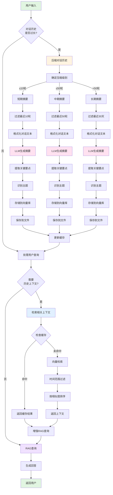

---

## 🔄 对话压缩详细流程

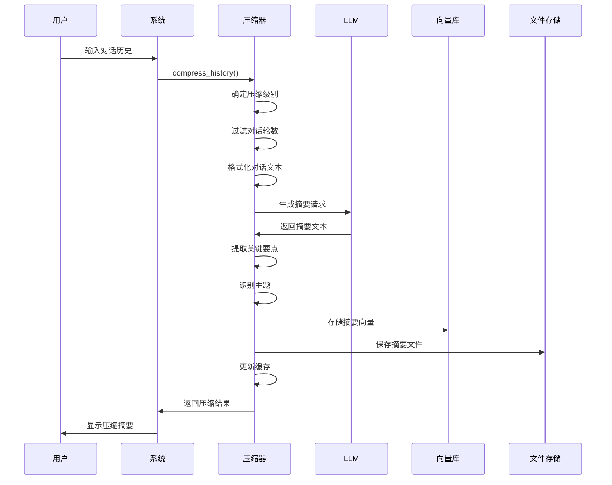

---

## 🔍 上下文检索详细流程

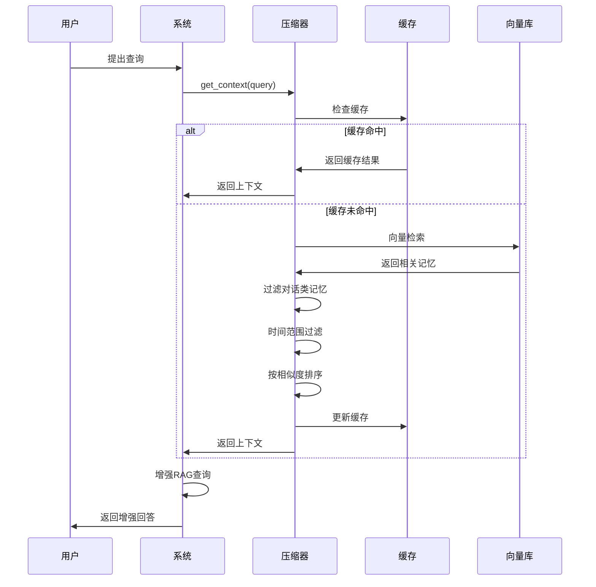

---

## 📊 数据流向图

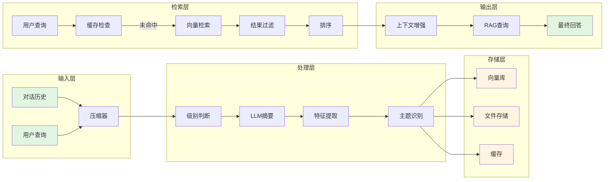

---

## 🎯 核心功能流程

### 1. 压缩流程

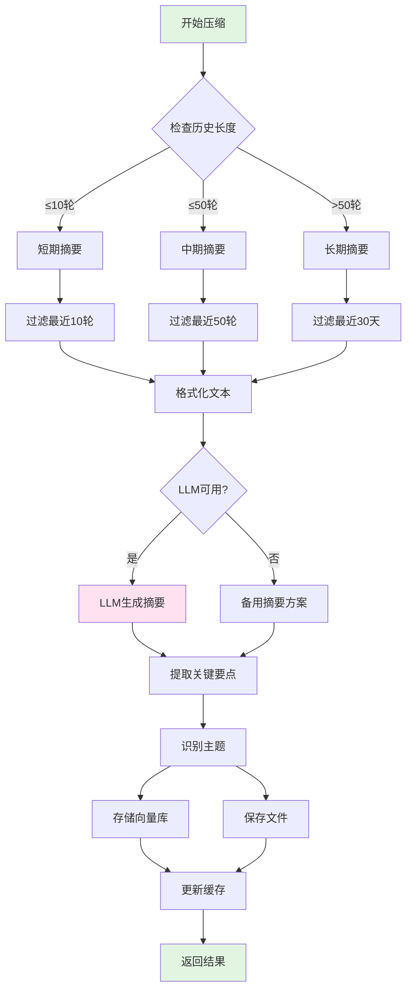

### 2. 检索流程

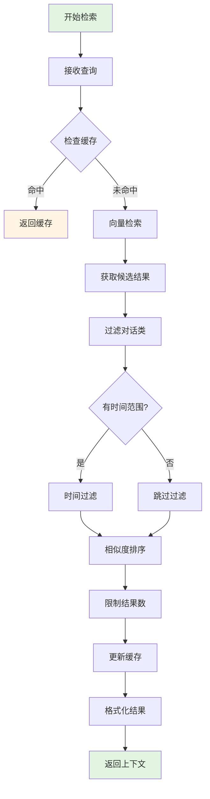

---

## 🗂️ 存储结构图

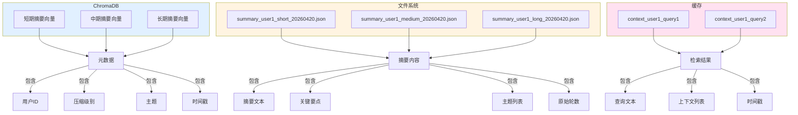

---

## ⚡ 性能优化流程

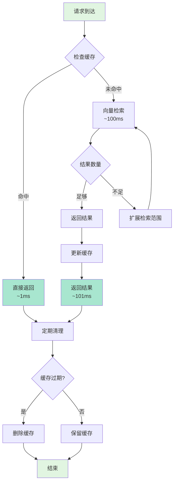

---

## 🔄 自动维护流程

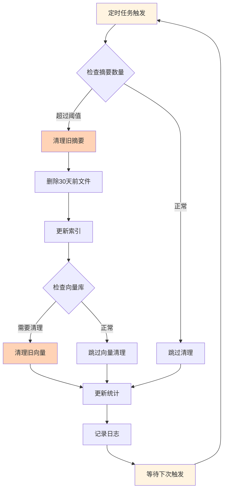

---

## 📈 压缩效果对比

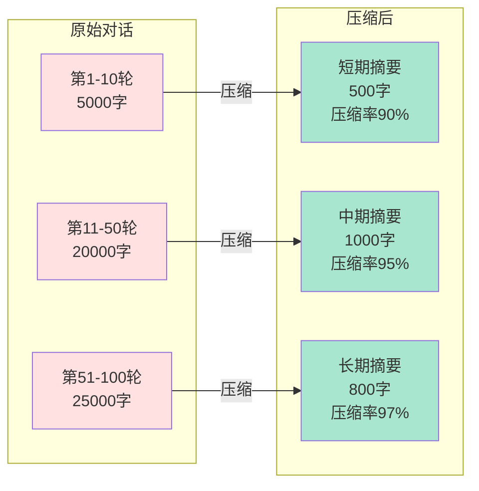

---

## 🎯 使用场景流程

### 场景1：长时间对话后压缩

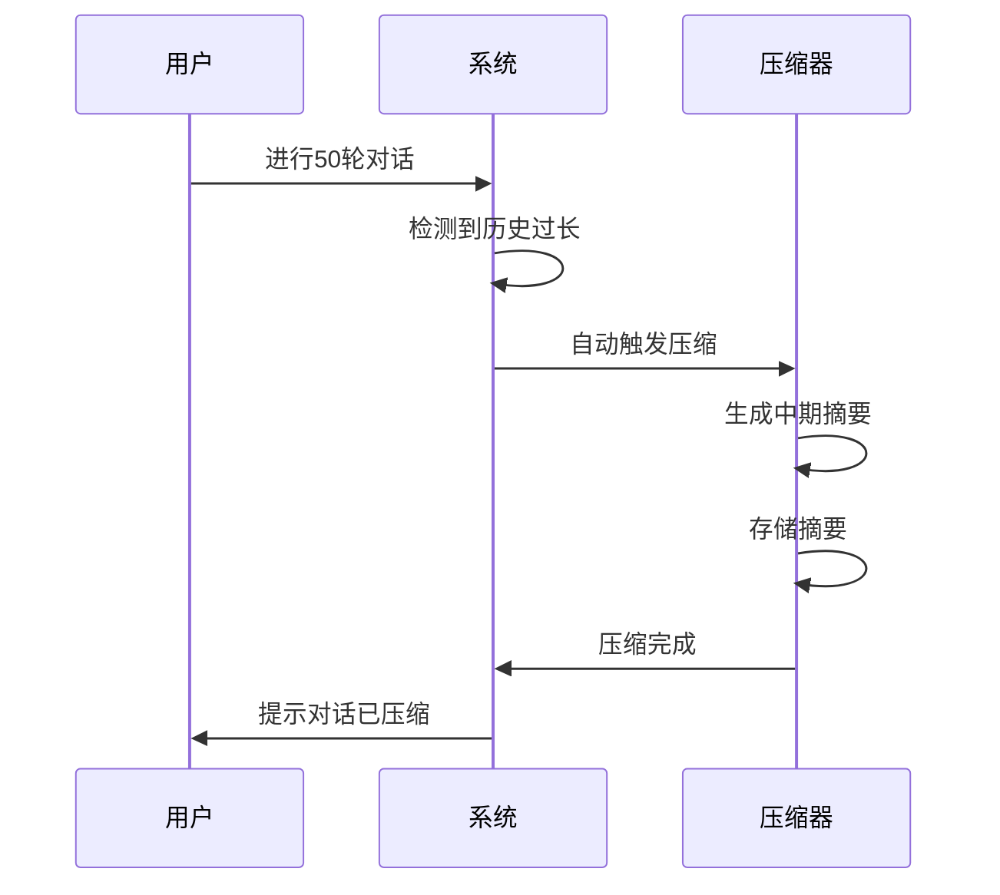

### 场景2：查询历史上下文

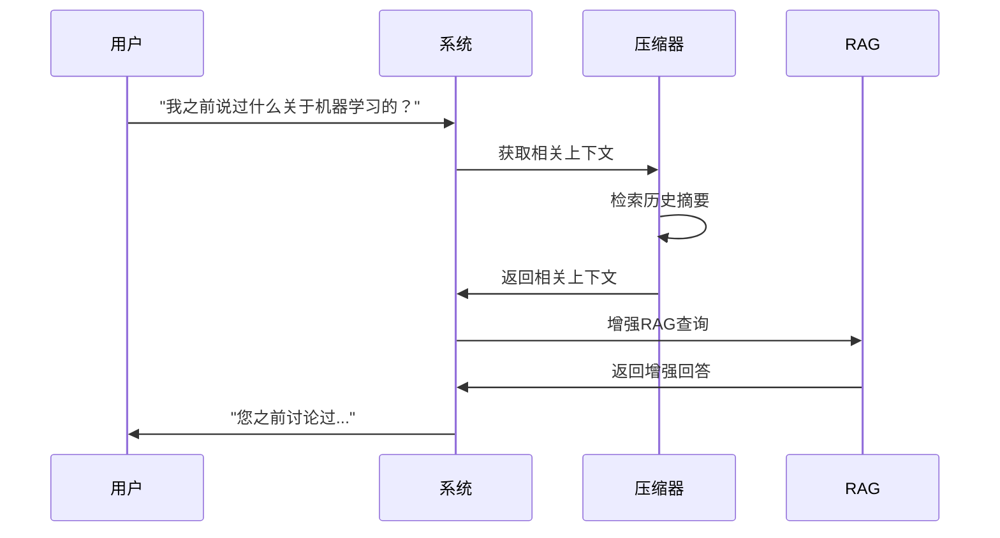

### 场景3：定期自动维护

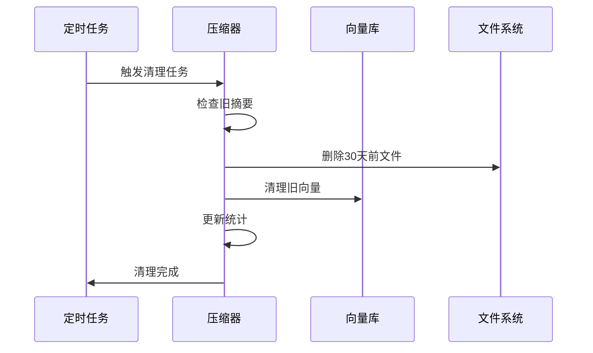

---

## 🚀 集成到RAG系统

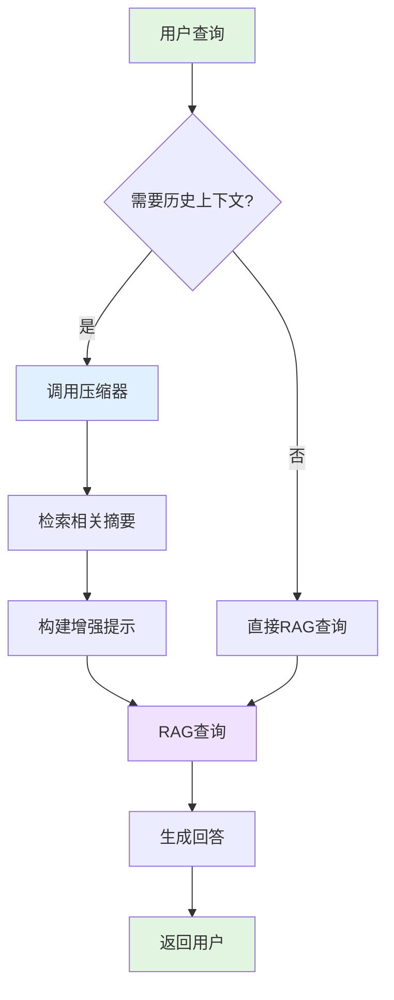

---

**流程图说明：**

1. **系统架构流程图**：展示整个系统的顶层架构和数据流向
2. **对话压缩详细流程**：展示压缩过程的时序交互
3. **上下文检索详细流程**：展示检索过程的时序交互
4. **数据流向图**：展示数据在各层之间的流动
5. **核心功能流程**：详细展示压缩和检索的决策逻辑
6. **存储结构图**：展示数据在不同存储介质中的组织方式
7. **性能优化流程**：展示缓存策略和性能优化机制
8. **自动维护流程**：展示定期清理和维护任务
9. **压缩效果对比**：展示压缩前后的数据量对比
10. **使用场景流程**：展示典型使用场景的交互流程
11. **集成到RAG系统**：展示如何与现有RAG系统集成

所有流程图都使用Mermaid语法，可以在支持Mermaid的Markdown查看器中渲染。