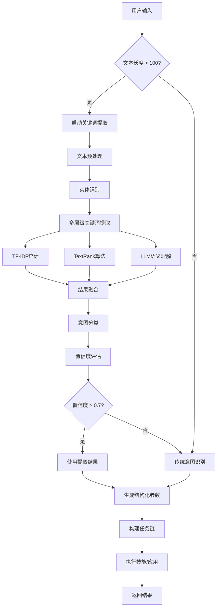

# 长文本关键词提取与任务执行指南

## 📋 目录
- [功能概述](#功能概述)
- [核心特性](#核心特性)
- [使用方法](#使用方法)
- [实际应用示例](#实际应用示例)
- [技术架构](#技术架构)
- [配置与优化](#配置与优化)

---

## 功能概述

本系统提供了**从用户长篇大论中自动提取关键词并执行操作**的能力。当用户输入较长的文本时，系统会：

1. **自动检测**文本长度
2. **智能提取**关键信息（动作、目标、实体等）
3. **增强意图识别**准确率
4. **自动生成**执行参数
5. **调用对应技能**完成任务

### 适用场景

✅ 用户描述复杂需求  
✅ 包含多个实体的长句  
✅ 混合多种指令的文本  
✅ 需要上下文理解的对话  

---

## 核心特性

### 1. 多层级关键词提取

系统采用**三种方法融合**提取关键词：

```python
# 方法1: TF-IDF词频统计
- 基于词频和位置权重
- 快速高效，适合短文本

# 方法2: TextRank图算法
- 基于词语共现关系
- 捕捉语义关联

# 方法3: LLM语义理解
- 使用GLM-4深度理解
- 最准确，但耗时较长
```

### 2. 智能实体识别

自动识别以下实体类型：

| 实体类型 | 示例 | 用途 |
|---------|------|------|
| 人名 | 张三、李四 | 发送消息、邮件 |
| 地点 | 北京、上海 | 查询天气、导航 |
| 时间 | 明天、下周一 | 设置提醒、日程 |
| 数字 | 10、80% | 数量限制、阈值 |
| URL | https://... | 网页爬取、访问 |
| 邮箱 | user@example.com | 发送邮件 |

### 3. 意图分类

支持识别的主要意图：

```python
- query: 查询信息（天气、股票、新闻等）
- search: 搜索内容（教程、视频、文章等）
- scrape: 爬取数据（热搜、排行榜等）
- send: 发送消息（邮件、微信、短信等）
- create: 创建内容（日程、任务、笔记等）
- delete: 删除内容（文件、任务等）
- analyze: 分析数据（统计、对比等）
- translate: 翻译文本
- play: 播放媒体（音乐、视频等）
- open/close: 打开/关闭应用
```

### 4. 置信度评估

系统会计算提取结果的**置信度分数**（0-1）：

- **> 0.7**: 高置信度，直接使用提取结果
- **0.5 - 0.7**: 中等置信度，结合传统方法
- **< 0.5**: 低置信度，降级为普通对话

---

## 使用方法

### 基础用法

```python
from core.keyword_extractor import get_keyword_extractor

# 获取提取器实例
extractor = get_keyword_extractor()

# 提取关键词
result = await extractor.extract("我想查询北京明天的天气，温度多少度")

# 查看结果
print(f"主要意图: {result.main_intent}")  # query_weather
print(f"动作词: {result.action_words}")    # ['查询']
print(f"目标词: {result.target_words}")    # ['天气']
print(f"地点: {result.entities.locations}") # ['北京']
print(f"时间: {result.entities.times}")     # ['明天']
```

### 在NLP处理器中使用

系统已**自动集成**到自然语言处理器中，无需额外配置：

```python
from core.natural_language_processor import get_nlp_processor

nlp = get_nlp_processor()

# 处理长文本（>100字符会自动启用关键词提取）
task_chain = await nlp.process(
    "你好，我需要你帮我查询一下北京市今天和未来三天的天气预报，"
    "包括温度、湿度、风力等信息，然后把这些数据整理成一个表格，"
    "最后发送邮件到我的邮箱user@example.com"
)

# 系统会自动：
# 1. 提取关键词：查询、天气、北京、今天、未来三天、邮件
# 2. 识别实体：地点=北京, 时间=今天/未来三天, 邮箱=user@example.com
# 3. 生成任务链：查询天气 → 整理数据 → 发送邮件
```

### 手动转换为参数

```python
# 将提取结果转换为技能参数
params = extractor.to_params(result)

# 生成的参数字典：
# {
#     "action": "查询",
#     "target": "天气",
#     "location": "北京",
#     "time": "明天",
#     "intent": "query_weather"
# }
```

---

## 实际应用示例

### 示例1: 复杂天气查询

**用户输入：**
```
我计划下周去北京出差，需要了解那边的天气情况。请帮我查询一下北京从周一到周五的天气预报，
包括每天的最高温度、最低温度、降水概率和空气质量指数。如果发现有雨天，请特别提醒我带伞。
另外，顺便查一下上海的天气，做个对比。
```

**系统处理流程：**

1. **检测长文本** ✓ (200+字符)
2. **提取关键词：**
   - 动作词: `['查询', '了解', '提醒']`
   - 目标词: `['天气', '预报', '温度']`
   - 地点: `['北京', '上海']`
   - 时间: `['下周', '周一', '周五']`

3. **识别意图:** `query_weather`
4. **生成参数:**
   ```json
   {
     "action": "查询",
     "target": "天气",
     "locations": ["北京", "上海"],
     "time_range": "下周周一至周五",
     "details": ["温度", "降水概率", "空气质量"]
   }
   ```
5. **执行任务:** 调用天气技能查询两地天气

---

### 示例2: 多步骤工作流

**用户输入：**
```
我需要完成一个市场调研任务。首先，请帮我爬取微博热搜榜的前20条内容，
然后分析这些热门话题的趋势和分布情况。接着，搜索一下最近关于人工智能的最新新闻报道，
特别是科技类媒体的文章。最后，把所有这些信息整理成一份报告，保存为PDF文件，
并通过邮件发送给项目组的三位成员：zhang@company.com、li@company.com和wang@company.com。
```

**系统处理流程：**

1. **检测长文本** ✓ (300+字符)
2. **提取关键词：**
   - 动作词: `['爬取', '分析', '搜索', '整理', '发送']`
   - 目标词: `['热搜', '趋势', '新闻', '报告']`
   - 实体: 
     - 数量: `['20']`
     - 邮箱: `[zhang@company.com, li@company.com, wang@company.com]`

3. **识别意图:** `multi` (多任务)
4. **生成任务链:**
   ```
   Step 1: 爬取微博热搜top20
   Step 2: 分析热搜趋势
   Step 3: 搜索AI新闻
   Step 4: 整理报告
   Step 5: 发送邮件给3人
   ```

---

### 示例3: 智能提醒设置

**用户输入：**
```
提醒我明天下午3点去参加一个重要会议，地点在北京市朝阳区国贸大厦A座15层会议室。
会议主题是Q2季度业绩汇报，需要准备PPT和数据报表。另外，在会议前1小时再提醒我一次，
让我有时间准备材料。如果可以的话，帮我把这个日程添加到日历中，并设置提前15分钟的提醒。
```

**系统处理流程：**

1. **提取关键信息：**
   - 时间: `['明天下午3点', '会议前1小时', '提前15分钟']`
   - 地点: `['北京市朝阳区国贸大厦A座15层']`
   - 事件: `['会议', 'Q2季度业绩汇报']`
   - 动作: `['提醒', '添加', '准备']`

2. **生成参数：**
   ```json
   {
     "event": "Q2季度业绩汇报",
     "time": "明天15:00",
     "location": "北京市朝阳区国贸大厦A座15层",
     "reminders": ["提前1小时", "提前15分钟"],
     "preparation": ["PPT", "数据报表"]
   }
   ```

3. **执行操作：**
   - 创建日历事件
   - 设置多重提醒
   - 添加待办事项

---

## 技术架构

### 整体流程



### 核心模块

#### 1. KeywordExtractor (`core/keyword_extractor.py`)

```python
class KeywordExtractor:
    """关键词提取器"""
    
    async def extract(self, text: str) -> ExtractionResult:
        """主提取方法"""
        
    def _extract_entities(self, text: str) -> ExtractedEntities:
        """实体识别"""
        
    async def _extract_keywords(self, text: str) -> List[KeywordInfo]:
        """多层级关键词提取"""
        
    def to_params(self, result: ExtractionResult) -> Dict[str, Any]:
        """转换为技能参数"""
```

#### 2. NaturalLanguageProcessor 增强 (`core/natural_language_processor.py`)

```python
class NaturalLanguageProcessor:
    async def process(self, message: str) -> TaskChain:
        # 自动检测长文本
        if len(message) > 100:
            extraction = await self._extract_keywords_from_long_text(message)
            intent = await self._recognize_intent_with_keywords(message, extraction)
        else:
            intent = await self._recognize_intent(message)
```

---

## 配置与优化

### 性能优化建议

#### 1. 调整长文本阈值

```python
# 在 natural_language_processor.py 中修改
is_long_text = len(message) > 100  # 可调整为50、150等
```

#### 2. 控制提取深度

```python
# 在 keyword_extractor.py 中调整
# 只使用前2种方法（更快）
keywords = self._extract_by_frequency(text)
keywords += self._extract_by_textrank(text)
# 注释掉LLM方法以提速
# keywords += await self._extract_by_llm(text)
```

#### 3. 缓存提取结果

```python
# 添加简单缓存
from functools import lru_cache

@lru_cache(maxsize=100)
def cached_extract(text_hash: str):
    """缓存提取结果"""
    pass
```

### 准确性优化

#### 1. 扩展词库

```python
# 在 keyword_extractor.py 中添加更多词汇
self.action_words.update([
    "预订", "购买", "预约", "注册", "登录", "注销"
])

self.target_words.update([
    "机票", "酒店", "餐厅", "景点", "商品"
])
```

#### 2. 自定义实体规则

```python
def _extract_custom_entities(self, text: str):
    """添加自定义实体识别规则"""
    # 例如：识别手机号
    phone_pattern = r'1[3-9]\d{9}'
    phones = re.findall(phone_pattern, text)
```

#### 3. 调整置信度阈值

```python
def _calculate_confidence(self, ...):
    confidence = 0.5  # 提高基础分
    
    # 增加更多加分项
    if len(keywords) >= 10:
        confidence += 0.3  # 原来0.2
```

### 依赖安装

```bash
# 基础依赖（必需）
pip install jieba

# 高级功能（可选）
pip install networkx scikit-learn

# LLM后端（已在系统中配置）
# 确保 .env 中有 ZHIPU_API_KEY
```

---

## 常见问题

### Q1: 为什么我的长文本没有被正确识别？

**A:** 检查以下几点：
1. 文本长度是否超过100字符
2. 是否包含明确的动作词和目标词
3. 查看日志中的置信度分数
4. 尝试简化表达，使用更明确的动词

### Q2: 如何提高提取速度？

**A:** 
- 禁用LLM提取方法（最快）
- 减少TextRank窗口大小
- 启用结果缓存
- 降低关键词数量限制

### Q3: 如何添加新的实体类型？

**A:** 在 `_extract_entities` 方法中添加：

```python
# 例如：识别价格
price_pattern = r'¥?\d+\.?\d*元'
prices = re.findall(price_pattern, text)
entities.prices = prices
```

### Q4: 关键词提取失败怎么办？

**A:** 系统有**多级降级机制**：
1. LLM失败 → 使用TextRank
2. TextRank失败 → 使用TF-IDF
3. 全部失败 → 返回空结果，不影响后续流程

---

## 测试与验证

运行测试脚本：

```bash
cd 小雷版小龙虾agent
python test_keyword_extraction.py
```

测试内容包括：
- ✅ 基础关键词提取
- ✅ NLP集成测试
- ✅ 边界情况处理
- ✅ 多语言支持
- ✅ 实体识别准确性

---

## 最佳实践

### 1. 用户输入建议

鼓励用户使用**清晰的结构化表达**：

```
✅ 好：请查询北京明天的天气，温度多少，会不会下雨
❌ 差：天气怎么样啊那个北京的明天
```

### 2. 开发者建议

- 定期更新词库，添加新词汇
- 监控置信度分布，调整阈值
- 收集bad cases，持续优化
- 记录提取日志，分析问题

### 3. 性能监控

```python
# 添加性能监控
import time

start = time.time()
result = await extractor.extract(text)
duration = time.time() - start

logger.info(f"提取耗时: {duration:.2f}s, 置信度: {result.confidence}")
```

---

## 总结

本系统通过**多层级关键词提取**和**智能实体识别**，实现了从用户长篇大论中自动提取关键信息并执行操作的能力。主要优势：

✅ **自动化**: 无需手动标注或配置  
✅ **智能化**: 融合多种NLP技术  
✅ **鲁棒性**: 多级降级机制保证稳定性  
✅ **可扩展**: 易于添加新规则和词库  
✅ **高性能**: 支持快速提取和缓存  

适用于各种复杂场景下的用户需求理解和任务执行！
