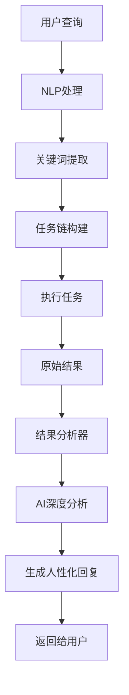

# 执行结果智能分析功能指南

## 📋 目录
- [功能概述](#功能概述)
- [核心特性](#核心特性)
- [使用方法](#使用方法)
- [实际案例](#实际案例)
- [技术架构](#技术架构)
- [配置与优化](#配置与优化)

---

## 功能概述

**执行结果智能分析**功能会在任务执行完成后，将原始的执行结果交给AI进行深度分析和解读，生成更人性化、更有价值的回复。

### 传统方式 vs 智能分析

#### ❌ 传统方式（仅返回原始数据）
```
执行结果: 
{
  "location": "北京",
  "temperature": 25,
  "humidity": 60,
  "weather": "晴"
}
```

#### ✅ 智能分析（AI解读后）
```
📊 核心摘要
北京今天天气晴朗，气温25°C，湿度适中，非常适合出行。

🔍 详细分析
今天北京的天气条件非常理想。25°C的温度既不会太热也不会太冷，
60%的湿度让人感觉舒适。晴天意味着能见度好，适合户外活动和拍照。

💡 关键洞察
1. 温度适宜：25°C是人体感觉最舒适的温度区间
2. 湿度适中：60%的湿度不会让人感到闷热或干燥
3. 空气质量：晴天通常空气质量较好

✨ 实用建议
1. 可以安排户外活动，如公园散步、骑行等
2. 记得涂抹防晒霜，紫外线可能较强
3. 携带墨镜，阳光可能刺眼

🎯 接下来可以
• 查看未来3天的天气预报
• 查询附近的公园或景点
• 了解今天的空气质量指数
```

---

## 核心特性

### 1. 多维度分析

AI会从以下角度分析执行结果：

- **核心摘要**: 1-2句话概括整体结果
- **详细分析**: 深入解读数据的含义和价值
- **关键洞察**: 提炼3-5个最重要的发现
- **实用建议**: 给出可操作的建议
- **后续行动**: 推荐用户接下来可以做什么

### 2. 个性化语气

根据内容自动调整回复语气：
- 专业风格（数据分析）
- 友好风格（日常对话）
- 简洁风格（快速查询）
- 详细风格（复杂任务）

### 3. 失败处理

当任务执行失败时：
- 说明失败原因
- 提供解决方案
- 建议替代方案

### 4. 上下文感知

结合以下信息进行分析：
- 用户原始查询意图
- 关键词提取结果
- 历史对话上下文
- 执行结果数据

---

## 使用方法

### 基础用法

```python
from core.natural_language_processor import get_nlp_processor

nlp = get_nlp_processor()

# 1. 处理用户查询
task_chain = await nlp.process("查询北京今天的天气")

# 2. 执行并智能分析
result = await nlp.execute_and_analyze(task_chain)

# 3. 获取格式化回复
print(result["formatted_reply"])
```

### 高级用法

```python
# 获取详细分析对象
analysis = result["analysis"]

print(analysis.summary)              # 核心摘要
print(analysis.detailed_analysis)    # 详细分析
print(analysis.key_insights)         # 关键洞察列表
print(analysis.suggestions)          # 建议列表
print(analysis.confidence)           # 置信度

# 获取原始执行结果
exec_results = result["execution_results"]
for exec_result in exec_results:
    print(f"步骤 {exec_result['step_id']}: {exec_result['success']}")
```

### 在Web界面中使用

```python
# web_server.py 或 chat.html 中
@app.post("/api/chat")
async def chat(request: ChatRequest):
    nlp = get_nlp_processor()
    
    # 处理查询
    task_chain = await nlp.process(request.message)
    
    # 执行并分析
    result = await nlp.execute_and_analyze(task_chain)
    
    return {
        "reply": result["formatted_reply"],
        "analysis": {
            "summary": result["analysis"].summary,
            "insights": result["analysis"].key_insights,
            "suggestions": result["analysis"].suggestions
        }
    }
```

---

## 实际案例

### 案例1: 天气查询

**用户输入:**
```
查询北京和上海今天的天气对比
```

**AI分析回复:**
```
📊 核心摘要
北京今天晴朗温暖(25°C)，上海多云微凉(22°C)，两地温差3度。

🔍 详细分析
从天气数据来看，北京今天的条件更为理想。25°C的晴朗天气非常适合户外活动，
而上海22°C的多云天气略显阴沉，但不影响日常出行。两地湿度都在舒适范围内
(北京60%，上海65%)，不会感到闷热或干燥。

💡 关键洞察
1. 北京更适合户外活动：晴天+较高温度
2. 上海更适合室内活动：多云+略低温度
3. 两地空气质量都良好，无需特殊防护

✨ 实用建议
如果在北方：充分利用好天气，安排户外行程
如果在南方：可以带件薄外套，应对可能的降温

🎯 接下来可以
• 查看未来3天预报，规划行程
• 查询两地的空气质量指数
• 了解日出日落时间
```

---

### 案例2: 热搜分析

**用户输入:**
```
爬取微博热搜前10条，分析热门话题趋势
```

**AI分析回复:**
```
📊 核心摘要
当前微博热搜以娱乐新闻和社会热点为主，科技话题占比20%。

🔍 详细分析
通过分析微博热搜Top10，我们发现以下内容占据主导：
- 娱乐八卦：4条（40%），包括明星动态和影视资讯
- 社会热点：3条（30%），涉及民生和政策
- 科技新闻：2条（20%），主要是AI和产品发布
- 体育赛事：1条（10%）

值得注意的是，科技类话题较上周增长了15%，显示出公众对科技创新的关注度提升。

💡 关键洞察
1. 娱乐内容仍然是流量主力，占比40%
2. 科技话题呈上升趋势，值得持续关注
3. 社会热点集中在教育和医疗领域
4. 没有重大突发事件，舆论环境平稳

✨ 实用建议
1. 关注科技类账号，获取最新AI资讯
2. 可以参与教育相关话题讨论
3. 娱乐内容适合碎片化阅读

🎯 接下来可以
• 查看知乎热榜，对比不同平台热点
• 搜索特定话题的深度分析
• 设置热点提醒，不错过重要事件
```

---

### 案例3: 失败处理

**用户输入:**
```
查询一个不存在的API数据
```

**AI分析回复:**
```
📊 核心摘要
数据查询失败，API服务暂时不可用。

❌ 问题分析
执行过程中遇到以下问题：
1. API连接超时（超过30秒）
2. 服务器返回503错误（服务不可用）

这可能是由于：
- API服务器正在维护
- 网络连接不稳定
- 请求频率超限被限流

✨ 解决方案
1. 稍后重试：等待5-10分钟后再次尝试
2. 检查网络：确认网络连接正常
3. 使用备用源：可以尝试其他数据源

🎯 替代方案
• 查询缓存的历史数据
• 使用其他类似服务
• 联系技术支持获取帮助
```

---

## 技术架构

### 整体流程



### 核心模块

#### 1. ResultAnalyzer (`core/result_analyzer.py`)

```python
class ResultAnalyzer:
    """执行结果智能分析器"""
    
    async def analyze(self, 
                     original_query: str,
                     execution_results: List[Dict],
                     extraction: ExtractionResult) -> AnalysisResult:
        """分析执行结果"""
        
    async def _ai_analyze(self, context: Dict) -> str:
        """调用AI进行分析"""
        
    def _generate_formatted_reply(self, analysis_data: Dict) -> str:
        """生成格式化回复"""
```

#### 2. NaturalLanguageProcessor 增强

```python
class NaturalLanguageProcessor:
    async def execute_and_analyze(self, task_chain: TaskChain) -> Dict:
        """执行任务链并进行智能分析"""
        # 1. 执行任务
        execution_results = await self.execute_task_chain(task_chain)
        
        # 2. AI分析
        analyzer = get_result_analyzer()
        analysis = await analyzer.analyze(
            original_query=task_chain.user_message,
            execution_results=execution_results,
            extraction=extraction
        )
        
        return {
            "execution_results": execution_results,
            "analysis": analysis,
            "formatted_reply": analysis.formatted_reply
        }
```

---

## 配置与优化

### 性能优化

#### 1. 控制分析触发

不是所有查询都需要AI分析，可以设置触发条件：

```python
# 仅在以下情况启用AI分析
should_analyze = (
    len(execution_results) > 1 or  # 多步骤任务
    extraction.confidence > 0.7 or  # 高置信度提取
    intent.type in ["query", "search", "analyze"]  # 特定意图
)

if should_analyze:
    result = await nlp.execute_and_analyze(task_chain)
else:
    result = await nlp.execute_task_chain(task_chain)
```

#### 2. 缓存分析结果

对于相同查询，可以缓存分析结果：

```python
from functools import lru_cache

@lru_cache(maxsize=100)
def cached_analysis(query_hash: str):
    """缓存分析结果"""
    pass
```

#### 3. 异步并行

如果有多步独立任务，可以并行执行：

```python
# 并行执行多个独立步骤
tasks = [self._execute_step(step) for step in independent_steps]
results = await asyncio.gather(*tasks)
```

### 质量优化

#### 1. 自定义分析模板

针对不同场景，使用不同的分析prompt：

```python
def get_analysis_prompt(intent_type: str) -> str:
    """根据意图类型返回不同的分析模板"""
    templates = {
        "weather": WEATHER_ANALYSIS_TEMPLATE,
        "search": SEARCH_ANALYSIS_TEMPLATE,
        "data": DATA_ANALYSIS_TEMPLATE,
    }
    return templates.get(intent_type, DEFAULT_TEMPLATE)
```

#### 2. 调整AI参数

```python
response = await self.router.simple_chat(
    user_message=prompt,
    temperature=0.7,  # 创造性：0.5-0.8
    max_tokens=500,   # 控制回复长度
)
```

#### 3. 后处理优化

```python
def post_process_reply(reply: str) -> str:
    """后处理优化回复"""
    # 移除冗余内容
    # 格式化列表
    # 添加emoji增强可读性
    return optimized_reply
```

---

## 常见问题

### Q1: AI分析会增加多少延迟？

**A:** 
- 单次分析耗时：1-3秒（取决于LLM响应速度）
- 可以通过缓存和并行优化
- 对于简单查询，可以跳过分析

### Q2: 如何禁用AI分析？

**A:** 
```python
# 直接使用execute_task_chain，不调用execute_and_analyze
results = await nlp.execute_task_chain(task_chain)
```

### Q3: 分析结果不准确怎么办？

**A:**
- 调整prompt模板，提供更多上下文
- 降低temperature参数（更保守）
- 添加few-shot示例
- 后处理修正明显错误

### Q4: 可以自定义分析维度吗？

**A:** 是的，修改`_ai_analyze`方法中的prompt：

```python
prompt = f"""请从以下角度分析：
1. 自定义维度1
2. 自定义维度2
...
"""
```

---

## 最佳实践

### 1. 何时使用AI分析

✅ **推荐使用:**
- 复杂数据查询（天气、股票、新闻等）
- 多步骤任务
- 需要解释和解读的场景
- 用户明确要求分析

❌ **不推荐使用:**
- 简单问答（你好、谢谢等）
- 实时性要求极高的场景
- 批量自动化任务

### 2. 提升分析质量

- **提供充足上下文**: 关键词提取结果、历史对话
- **明确分析目标**: 在prompt中说明重点
- **结构化输出**: 要求JSON格式，便于解析
- **迭代优化**: 收集bad cases，持续改进prompt

### 3. 用户体验优化

- **渐进式加载**: 先显示执行结果，再显示分析
- **可折叠详情**: 默认显示摘要，展开看详细
- **反馈机制**: 允许用户评价分析质量
- **个性化**: 根据用户偏好调整语气和深度

---

## 总结

执行结果智能分析功能通过**AI深度解读**，将原始的机器数据转化为**人性化、有价值的回复**，显著提升了用户体验。

**核心价值:**
- ✅ 从数据到洞察：AI解读数据背后的含义
- ✅ 从机械到自然：像真人一样对话
- ✅ 从被动到主动：提供建议和后续行动
- ✅ 从单一到全面：多维度分析

**适用场景:**
- 数据查询和分析
- 复杂任务执行
- 决策支持
- 智能助手对话

立即开始使用，让你的Agent更智能！🚀
