# 对话记录 & 记忆存储流程图

```mermaid
graph TB
    subgraph loop["① 对话记录（纯内存，永不落盘）"]
        HIST1["ReAct 每轮:<br/>ctx._conversation_history.append()"]
        HIST2["包括: assistant消息 + tool结果"]
        HIST3["→ 传给下一轮 LLM 做上下文"]
        HIST1 --> HIST2 --> HIST3
    end

    subgraph persist["② 持久化存储（三路并行）"]
        STM["Short-Term Memory<br/>~/.xiaolei.xiaolongxia/memory/"]
        VEC["Vector Memory<br/>ChromaDB"]
        SES["Session Artifact<br/>~/.xiaolei/sessions/"]
    end

    subgraph stm_flow["Short-Term Memory（文件存储）"]
        STM1["on_tool_end: stm.add(工具摘要)"]
        STM2["on_finish: process_turn()"]
        STM3["  ├ stm.add(用户消息)"]
        STM4["  ├ stm.add(助手回复[:2000])"]
        STM5["  ├ FactExtractor.extract()"]
        STM6["  ├ UserProfile.add_fact()"]
        STM7["  └ VectorMemoryStore.add_memory()"]
        STM1 --> STM2 --> STM3 --> STM4 --> STM5 --> STM6 --> STM7
    end

    subgraph sv_flow["Session Artifact（文件存储）"]
        SES1["run_react 入口: create_session()"]
        SES2["on_tool_end: record_artifact(关键工具)"]
        SES3["完成后: record_artifact(conversation_log)"]
        SES4["on_finish: record_artifact(final_answer)"]
        SES5["on_finish: finalize_session()"]
        SES6["→ 写入 index.json"]
        SES1 --> SES2 --> SES3 --> SES4 --> SES5 --> SES6
    end

    subgraph vec_flow["Vector Memory（ChromaDB）"]
        VEC1["process_turn: add_memory(事实)"]
        VEC2["on_finish: SessionVectorIndex.add_session()"]
        VEC3["SelfEvolution: 生成洞察"]
        VEC1 --> VEC2 --> VEC3
    end

    loop -->|永不落盘| STM
    loop -->|永不落盘| VEC
    loop -->|永不落盘| SES

    stm_flow -.->|on_llm_invoke 时读取| loop
    sv_flow -.->|跨会话检索| VEC2
```

## 关键数据流

| 环节 | 存储位置 | 持久化？ | 何时写入 | 何时读取 |
|------|---------|---------|---------|---------|
| `_conversation_history` | 内存 List | ❌ 永不落盘 | 每轮 append | 每轮传给 LLM |
| STM 工具摘要 | `~/.xiaolei.xiaolongxia/memory/*.md` | ✅ | `on_tool_end` | `on_llm_invoke`（最近5条×200字） |
| STM 对话 | 同上 | ✅ | `on_finish.process_turn` | 同上 |
| 用户画像 | `~/.xiaolei.xiaolongxia/profiles/*.json` | ✅ | `process_turn` → 事实提取 | `on_llm_invoke` → `get_user_context` |
| 向量记忆 | ChromaDB `long_term_memory` | ✅ | `process_turn` → `add_memory` | `on_llm_invoke` → `search_memories`（top_k=5×150字） |
| Session artifact | `~/.xiaolei/sessions/{id}/artifacts/*.md` | ✅ | `on_tool_end` / `on_finish` | 子代理 `read_file` / 跨会话回溯 |
| 会话索引 | `~/.xiaolei/sessions/index.json` | ✅ | `finalize_session` | `build_context_block`（最近3个） |
| 会话向量 | ChromaDB `session_artifacts` | ✅ | `on_finish` → `add_session` | 语义搜索历史会话 |

## 关键问题

1. **`_conversation_history` 永不落盘**：进程结束全丢。现在用 `conversation_log.md` artifact 补救了
2. **STM 压缩**：>24000 token 时自动删除旧文件，>28000 时 LLM 压缩摘要
3. **子代理污染**：子代理的 `on_finish` 本来也会写 STM/向量库 → 已修复跳过 `process_turn`
