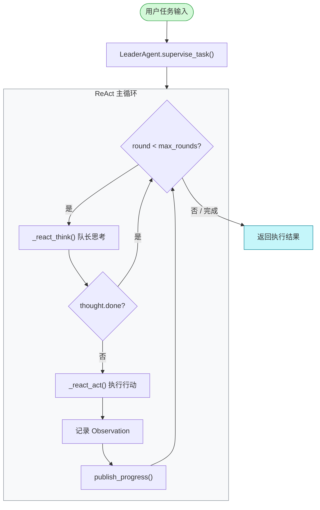
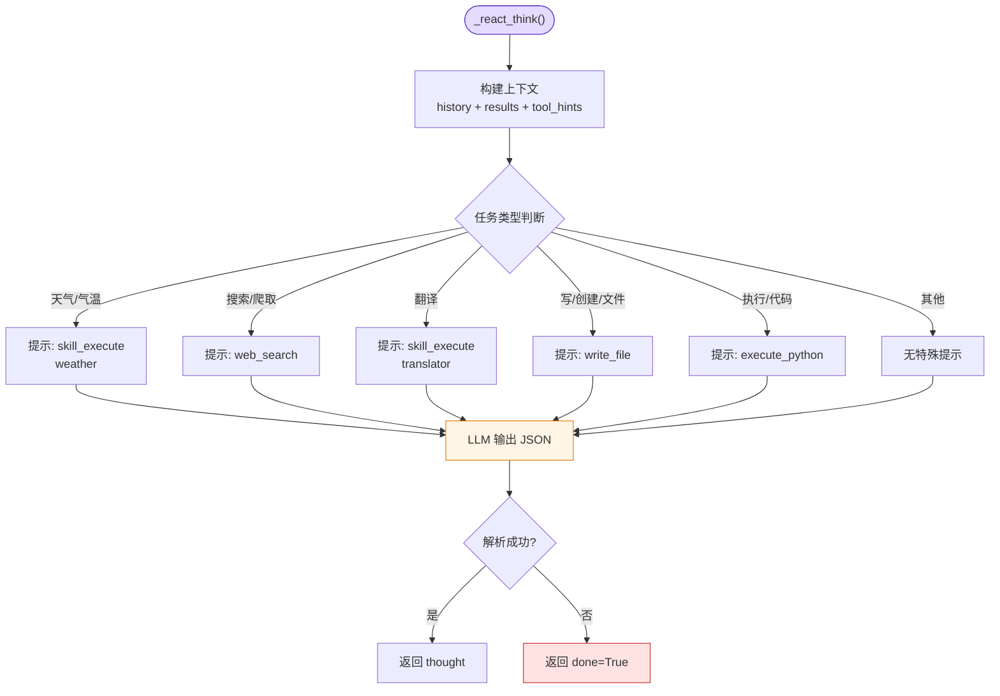
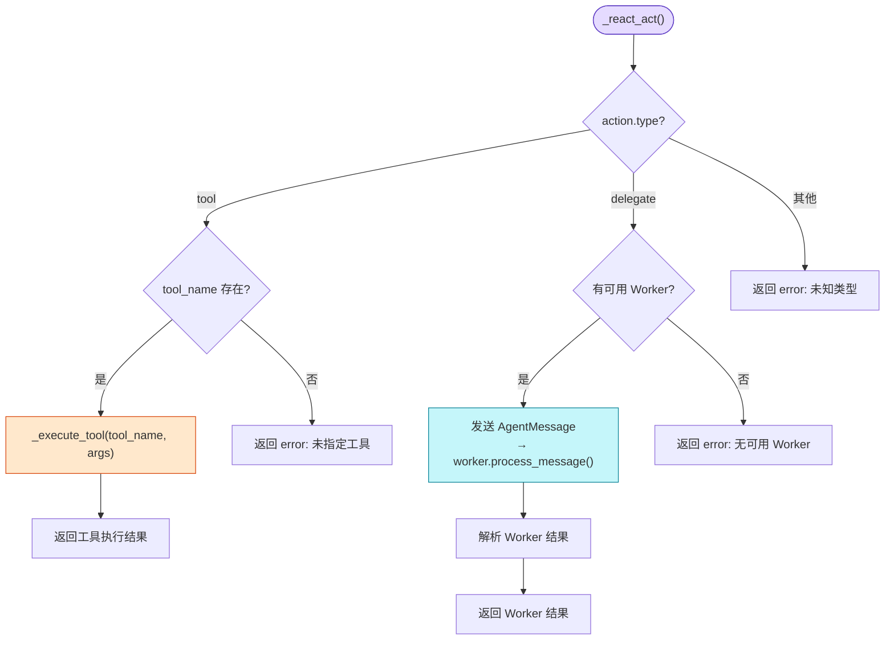
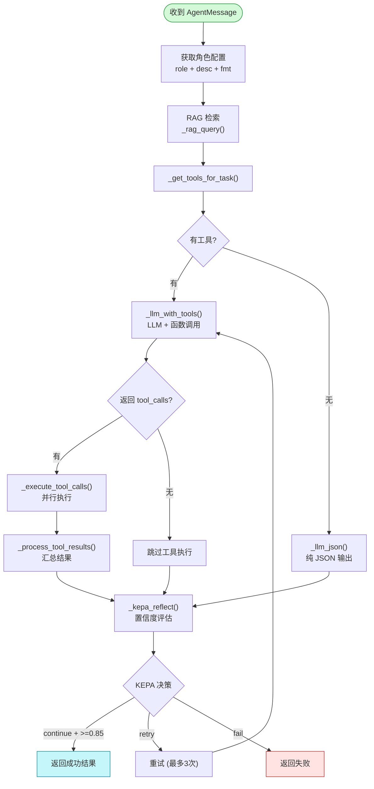
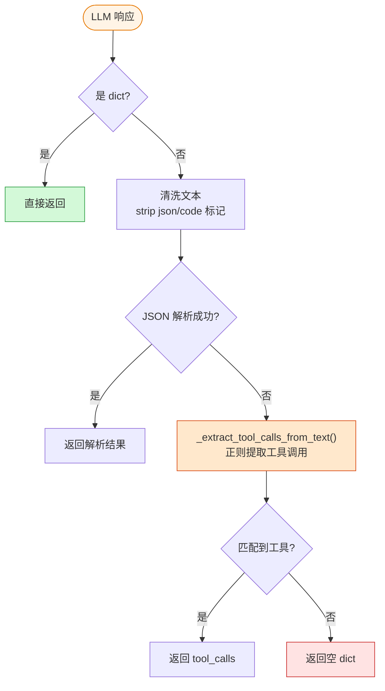
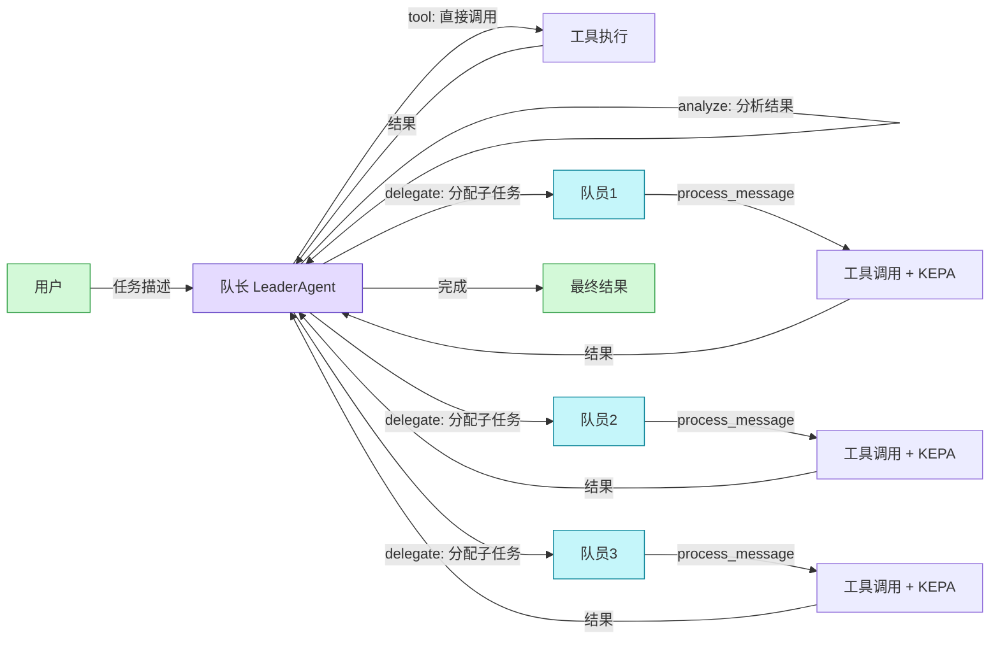

# V1 架构执行流程图

## 1. 主流程 — 队长 ReAct 循环



## 2. Thought 阶段 — 队长决策



## 3. Action 阶段 — 两种行动类型



## 4. Worker 执行流程 — _handle_message()



## 5. 工具调用格式 — LLM 响应解析



## 6. 端到端数据流



## 7. 关键方法调用栈

```
LeaderAgent.supervise_task()
  ├── _react_think()           # 队长思考 → LLM 决策
  ├── _react_act()             # 执行行动
  │   ├── [tool]     → _execute_tool()          # 直接调用工具
  │   └── [delegate] → worker.process_message()  # 分配给队员
  │       └── _handle_message()
  │           ├── _rag_query()                   # RAG 检索
  │           ├── _get_tools_for_task()           # 获取工具列表
  │           ├── _llm_with_tools() / _llm_json() # LLM 调用
  │           ├── _execute_tool_calls()           # 并行执行工具
  │           ├── _process_tool_results()         # 汇总工具结果
  │           └── _kepa_reflect()                # KEPA 置信度评估
  └── (循环直到 done 或 max_rounds)
```
